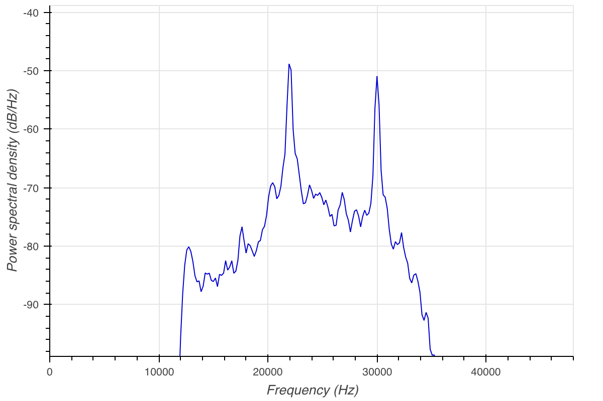
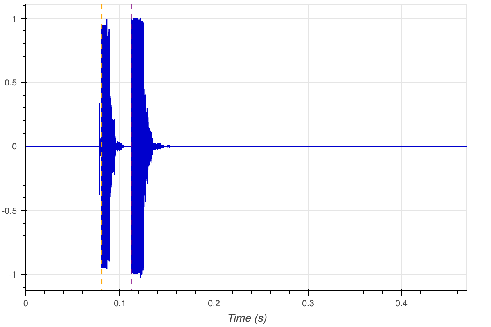
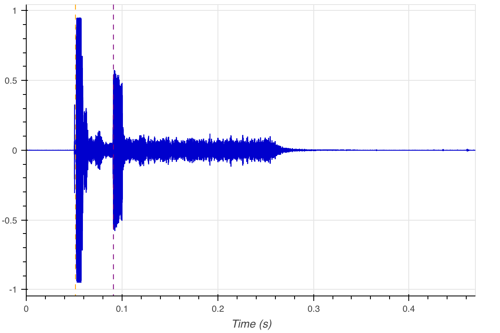
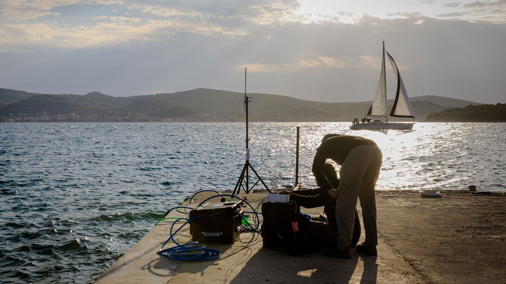

It is a common practice to attach a transponder to various underwater assets (both static and mobile) for short and long term field deployments. These transponders can act as a beacon that can be utilized for localization. An underwater vehicle (e.g. AUV, ROV) will be able to do sequential ranging to find the location of the transponder during a search and rescue operation.

Normally, specialized transmitters are required to send a signal to these transponders to trigger a response. However, due to the software defined nature of Subnero modems, it is fairly easy to develop an application that will query a transponder and calculate the range information.


In this post, we showcase a fully functional transponder ranging application used to ping an [Applied Acoustics 219A](https://www.ashtead-technology.com/rental-equipment/aa-219-micro-beacon/) transponder and calculate the range to it from the recorded signal. This work has been presented in [_M. Chitre, R. Bhatnagar, M. Ignatius, and S. Suman, “Baseband signal processing with UnetStack,” in Underwater Communications Networking (UComms 2014), (Sestri Levante, Italy), September 2014. (Invited)_](http://arl.nus.edu.sg/twiki6/pub/ARL/BibEntries/sdmodem.pdf).

An Applied Acoustics 219A transponder is set to receive a 22 kHz tonal. We send a 5 ms long 22 kHz pulse without preamble (preambleID set to 0) using a `TxBasebandSignalReq` from UnetStack's _baseband_ service. This will trigger a response at 30 kHz after a fixed delay of 30 ms. We also initiate a 500 ms long baseband signal recording using `RecordBasebandSignalReq` to make sure the modem records long enough to have the response from the pinger.

The captured signal is then Hilbert transformed to do envelop detection. We use thresholding to find the start of the received signal. We also retrieves the `txTime` from `txntf`. Using these two timings, we calculate the range to the transponder.

This application is developed using Jupyter Notebook, in Python using the UnetPy framework.


```python
import numpy as np
import arlpy.signal as asig
from arlpy.plot import *
from unetpy import *
```

### Connect to the modem
Using the unetpy gateway, connect to the modem's IP address and subscribe to `physical` agent.


```python
modem = UnetGateway('192.168.1.74')
```


```python
phy = modem.agent('phy')
modem.subscribe(phy)
```

### Set passband block count, signal power level and other constants
Before starting passband recording, we need to set the passband block size using `phy.pbsblk` parameter. (Passband block size is the number of samples in a block of recorded passband data)


```python
txFs = 192000              # Sa/s
sigLen = 5e-3              # s
timeout = 5000             # ms
threshold = 0.3
soundSpeed = 1520          # m/s
triggerSig = 22000         # Hz
transponderDelay = 30e-3   # s

phy.pbsblk = 45056         # Sa
phy.signalPowerLevel = -6  # dB
```

### Flush the modem to clear its internal buffers


```python
def flush_modem():
    while modem.receive(timeout=1000):
        pass
```

### Generate the signal to be transmitted
We use the [`cw`](https://arlpy.readthedocs.io/en/latest/signal.html#arlpy.signal.cw) function from arlpy signal processing toolbox to generate a 5 ms long 22 kHz tonal.


```python
tx = asig.cw(triggerSig, sigLen, txFs).tolist()
```

### Start baseband signal reception and transmit the signal
We start a passband recording by setting `phy.pbscnt` to 1. This will start the recording of 1 block of passband data. The next step is to transmit the 22 kHz tonal. We also note down the transmission time (start of the transmission) and reception time (start of the receiving block of pb data).


```python
flush_modem()
phy.pbscnt = 1
phy << org_arl_unet_bb.TxBasebandSignalReq(signal=tx, fc=0)
rx = modem.receive(org_arl_unet_bb.RxBasebandSignalNtf, timeout)
rxS = rx.signal
rxFs = rx.fs
txntf = modem.receive(timeout=timeout)
txTime = txntf.txTime
rxTime = rx.rxTime
```

### Plot the recorded signal & PSD
Using arlpy's plotting utilities, we plot the time series and marked `txTime`. Note that we can see the transmitted data (saturated) in the recoded passband signal time series. In the PSD, we can see both transmission (22 kHz) and received tonal (30 kHz) clearly.


```python
plot(rxS, fs=rxFs, maxpts=rxFs, hold=True)
txStart=(txTime-rxTime)/1e6
vlines(txStart, color='orange')
```


```python
psd(rxS, fs=rxFs)
```




### Identifying receive time
The next step is to identify the first sample from the received signal. For this, we shift the start of the received signal by txStart + transponderDelay, generate a Hilbert envelop of the remaining signal and do a threshold detection. Both `txStart` and `rxStart` is marked in the plot.

The Hilbert envelop is generated using the [envelop](https://arlpy.readthedocs.io/en/latest/signal.html#arlpy.signal.envelope) function from arlpy signal processing toolbox.


```python
start = txStart+transponderDelay
newRx = rxS[int(start*rxFs):]
env = asig.envelope(newRx)
edge = np.argwhere(env>threshold)[0,0]
```


```python
plot(env, fs=rxFs, maxpts = rxFs, hold=True)
vlines(edge/rxFs, color='orange')
```



```python
plot(rxS, fs=rxFs, maxpts = rxFs, hold=True)
rxStart=(start+edge/rxFs)
vlines(txStart, hold=True, color='orange')
vlines(rxStart, color='purple')
```


### Calculating the range
Now that we have the `txTime` and `rxTime`, we can calculate the range. This test was conducted at Adriatic sea, during BTS 2018.



```python
print ('Tx Start = ', txStart, 's')
print ('Rx Start = ', rxStart, 's')
travelTime = rxStart-txStart-transponderDelay
print ('Round trip time = ', travelTime, 's')
print ("Range = {0:.2f} m".format(soundSpeed * travelTime/2))
```

    Tx Start =  0.051419 s
    Rx Start =  0.09109608333333333 s
    Round trip time =  0.00967708333333333 s
    Range = 7.35 m


```python
modem.shutdown()
```
