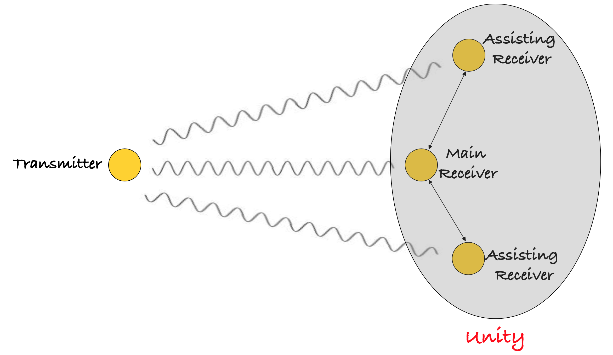
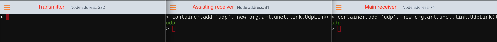
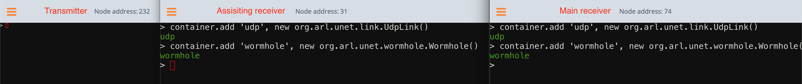
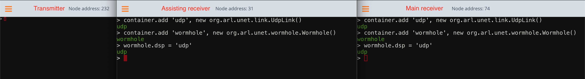
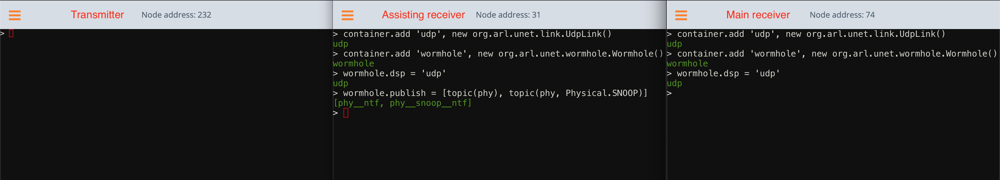
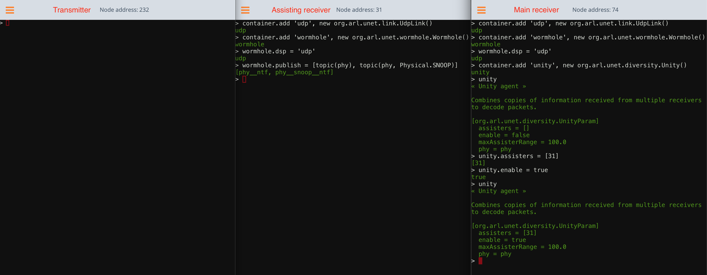
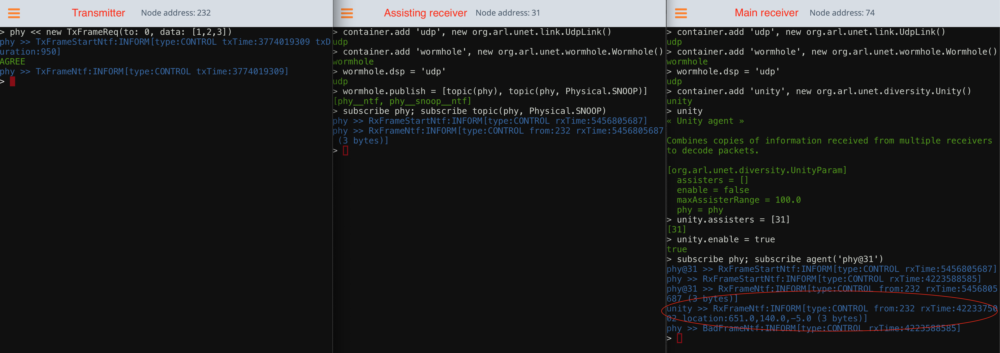

Spatial diversity techniques that are used in terrestrial networks usually utilize multiple antennas on the same device to improve link quality and reliability. Similarly, having multiple hydrophones/transducers on the same underwater node might help with the same but comes with the cost of a significant increase in the size due to the spatial separation that might be needed between transducers.  Although it has proved and delivered tangible benefits to the end-user in the terrestrial wireless networks,  much is not talked about practical spatial diversity systems in underwater wireless networks. Can we exploit a similar technique to make underwater wireless networks faster and more reliable and make that long-range communication link "just work"? With the capability to exploit distributed spatial diversity, yes you can!

### What's the key idea involved in distributed spatial diversity ?

*Multiple communication nodes deployed at spatially distinct locations can receive independent copies of the same information. This group of receiver nodes can act as a combined spatial diversity receiver when they cooperate by sharing copies of information. We term this distributed spatial diversity. The framework supporting this patent-pending technique is implemented in UnetStack 3.1 and is referred to as _Unity_.*


An illustration of the general overview of such a receiver system is shown above and few terminologies might help for further discussion:

- *Transmitter:* A node which transmits information
- *Main receiver:* A node that acts as the main receiver in a group of receiver nodes. It is the main receiver's responsibility to decode the information.
- *Assisting receiver:* A node that acts as an assisting receiver in a group of receiver nodes. It is the assisting receiver's responsibility to forward the relevant information to the main receiver.

The assisting receiver nodes are in cahoots with the main receiver to cooperatively share the information. This sharing of information usually happens over a short-range wired or wireless network (e.g., WiFi, TCP/IP, UDP/IP). Although, nothing stops one from using a different technology for sharing information.

### What's the immediate practical advantage one can see ?

Consider a case where you are on a ship with a modem deployed and you've been receiving status updates from a deployed AUV every few minutes. The AUV moves into an area where the connectivity is poor, and you can no longer successfully receive the status reports. We've all experienced being in that situation where the underwater communication link breaks, haven't we?

If you have a second modem available on the ship, you deploy it from another part of the ship. Or maybe there is a gateway buoy deployed nearby with a modem, and you can connect to its modem. Either way, the distributed spatial diversity technique (`Unity`) magically uses the information from both modems to recover connectivity to the AUV!

### So how to use `Unity` in UnetStack 3.1?

`Unity` is available as a premium agent and requires UnetStack 3.1 and higher.

Configuring and using `Unity` agent to exploit spatial diversity is easy with just two simple steps:

1. Setup the receiver nodes to cooperate.
2. Add the `Unity` agent on the main receiver.


#### 1. Set up for receiver nodes to cooperate (an example):

To set up the group of receivers to cooperate over a short-range network, we use [`Wormhole`](https://unetstack.net/handbook/unet-handbook_preface.html)  agent provided in UnetStack.  Transmitter node makes a transmission that is heard at all the receiver nodes. However, none of the nodes are able to successfully recover the information received, as the communication link is noisy.  In order to share the received noisy signals among the receivers, we can connect the receiver nodes using a `Wormhole`. A UDP connection between the two receiver nodes, over any IP based network (Ethernet, WiFi), can be established by adding just a few lines of code on the receiver nodes as shown below:

```groovy
container.add 'udp', new org.arl.unet.link.UdpLink()
container.add 'wormhole', new org.arl.unet.wormhole.Wormhole()
wormhole.dsp = 'udp'
```
Line (1) adds a [`UdpLink`](https://unetstack.net/handbook/unet-handbook_wired_and_over_the_air_links.html) agent that implements a link protocol over UDP/IP for use over wired/wireless IP networks.

An example when you run the above on three simulated modems is shown below:



Line (2) adds a `Wormhole` agent which allows the [fjåge](https://fjage.readthedocs.io/en/latest/) messages to be sent between containers over a [Unet link](https://unetstack.net/handbook/unet-handbook_introduction.html) as shown below:



Line (3) tells the `Wormhole` agent to use the `UdpLink` as the Unet link to share information.



*Additional set up on the assisting receiver* :

We may not want to share the information from all agents, instead, we are interested in messages that are published on the Physical agent's topic on the main receiver.
```groovy
wormhole.publish = [topic(phy), topic(phy, Physical.SNOOP)]
```
The above line of code is added only on the assisting receivers  as shown below to forward only the messages received on the `Physical` agent's topic to be sent over the `Wormhole` link.



That's all there is to set up the receiver nodes to share the information and cooperate (in this case over a `UdpLink`). With this set up any message received on the `Physical` agent's topic on the assisting receiver will also be available at the main receiver. This will become clearer through an example in the last section.

#### 2. Add the `Unity` agent on the main receiver:

Now that the receiver nodes are ready to cooperate, we can go ahead and add the `Unity` agent on the main receiver node.

```groovy
container.add 'unity', new org.arl.unet.diversity.Unity()
```
A user can take a look at the parameters of the `Unity` agent after loading the agent, type `unity` on the node's web shell interface:
```
> unity
« Spatial diversity agent »

Combines copies of information received from multiple
receivers to decode packets.

[org.arl.unet.unity.UnityParam]
  assisters = []
  enable = false
  maxAssisterRange = 100.0
  phy = phy
```
The `assisters` parameter is used to store the node addresses of the assisting receivers that are assisting the main receiver. The user might also want to change the default value of `maxAssisterRange` if the furthest assisting receiver to the main receiver is at a distance larger than 100 m.

For example, in out three simulated modems, the node address of the assisting receiver is 31 and therefore we should set:

```groovy
unity.assisters = [31]
unity.enable = true
```
Once the assisters node addresses are set, as shown above, the `Unity` agent is enabled. And voila, you are ready to see the benefits of cooperating receivers in terms of reliability and effective data rate. An example of the output in the web interface with three simulated modems is as shown below:



### Now that we are set up, what to expect ?

Now that we are all set up with an assisting receiver and a main receiver cooperating over a `UdpLink`, we would like to see an example of `Unity` in action. Although, we will not be able to demonstrate all the scenarios in which `Unity` will be beneficial, we can show how it works and what to expect out of it. 

Let us transmit a frame from the transmitter node by sending a simple `TxFrameReq` message to the `Physical` agent as shown below:



The transmitted frame is broadcasted in the network and for the purpose of this demonstration, the modulation scheme parameter on the main receiver is changed to make sure it cannot decode the received frame successfully and therefore you see a `BadFrameNtf` message (meaning the frame was not successfully decoded) on the main receiver. But notice that the assisting receiver successfully decoded the received frame and it was forwarded over to the main receiver via the `wormhole`. This can be observed in the shell output:
```
phy@31 >> RxFrameNtf:INFORM[type:CONTROL from:232 rxTime:5456805687 (3 bytes)]
```
on the main receiver. Notice that this information sharing happened transparently due to our initial set up where all messages getting published on assisting receivers `Physical` agent (recognized by `phy@31` at the main receiver) are being received on the main receiver. 

The `Unity` agent now utilizes this message from the assisting receiver to publish the frame on main receiver's `Physical` agent's topic as shown below:
```
unity >> RxFrameNtf:INFORM[type:CONTROL from:232 rxTime:4223375002 location:651.0,140.0,-5.0 (3 bytes)]
```

In this, simple example the assisting receiver was able to successfully decode the frame and it helped the main receiver via sharing this information. This is also called *Selection diversity*. The other cases where `Unity` agent will prove useful is where both assisting receiver and main receiver could not decode the frame successfully. In such cases, the information in `BadFrameNtf` messages (e.g., log-likelihood ratios of each received bit) is used to combine the information from both receivers and the `Unity` agent tries to decode the frame. This is also termed as `Diversity combining`.

The ability to utilize selection diversity and diversity combining  at  the  same  time  is  extremely  advantageous  in practice. This results in significant performance improvement in terms of data rate and reliability. 
