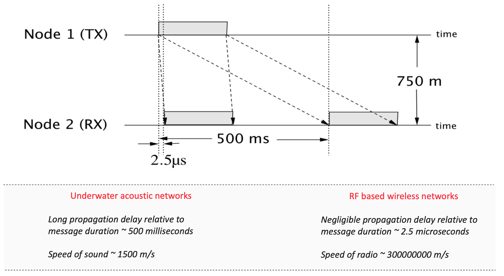
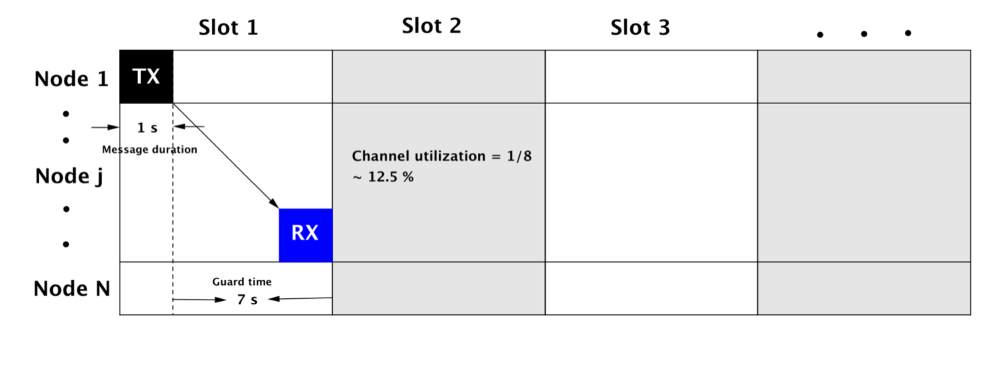
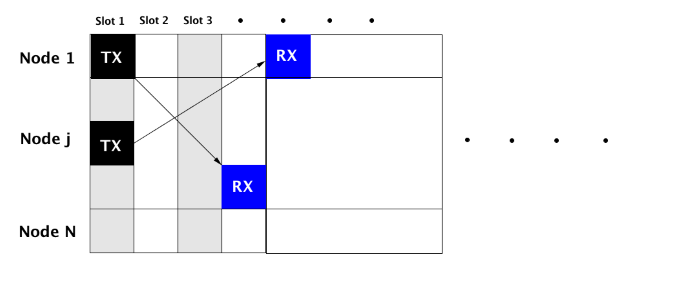
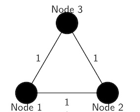
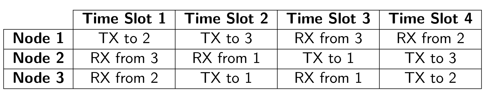
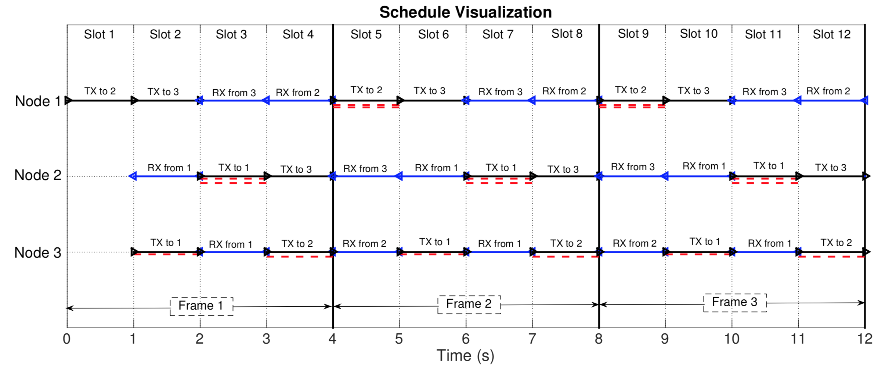

Underwater acoustic (UWA) networks will play a key role in many areas including marine, offshore and subsea industries in the future. There have been tremendous and impressive technological advances in underwater acoustic communications and networking field. The one that caught my attention and brought about a clear difference in the novel approaches that are needed to deal with challenges in UWA networks was the "exploitation" of large propagation delays that exist in UWA networks. 

Do you know that it is possible to achieve as much as 50% higher network throughput with specific network geometries and protocols in UWA networks when compared to radio-frequency (RF) based terrestrial wireless networks? 

It is an interesting and surprising fact that has led to further exploration of such techniques in practical settings. In this blog, let's try and understand, where that advantage comes from, through an example technique (*Super-TDMA*). We will try and understand the key idea behind this technique and let's see why it is "super".

### Long propagation delays



Let us first understand what is meant by a long propagation delay. Specifically, how "long" does it have to be? If the propagation delay in a medium is larger (or in the same order) in comparison to the message duration, i.e., the time it takes when a signal/message is transmitted is much larger in comparison to the signal/message duration, then the propagation delay is considered long. This is quite easy to understand if we look at an example. Consider a transmitter and a receiver node placed at say 750 m apart. When placed in water, an acoustic signal carrying information will take approximately 500 ms to reach the receiver, whereas, in air, an RF signal for the same setup will take approximately 2.5 microseconds. If the message duration is in the order of milliseconds, it is easy to see that the long propagation delay exists in the UWA setup where the propagation delay of 500 ms is much larger.

### Traditional TDMA

It is easiest to show how the long propagation delay can be harnessed to achieve higher throughput using a simple contention-free medium access control technique called [Time Division Multiple Access (TDMA)](https://en.wikipedia.org/wiki/Time-division_multiple_access). In traditional TDMA protocols, every node in the network is assigned a fixed time slot in which it can transmit information. Appropriate amounts of guard time in each time slot must be left to make sure the intended receiver node receives the message successfully. As you can imagine, this protocol may not be great in networks that suffer from long propagation delays, right ?


Consider a large 10 km network, i.e., the farthest distance between a transmitter and receiver node is 10 km. In this case, for a message to reach the farthest receiving node, it may take approximately ~ 7 seconds (see above figure). If the message duration is 1 second long, the channel utilization efficiency is 1/8 which is 12.5% and not very impressive.

### Super TDMA

The key idea involved in Super-TDMA is visualized in the figure below. Since the message duration is much shorter than the propagation delay, a natural question arises. 

*Can a message be scheduled to be transmitted in one slot and be received in a different slot ?* 

If the transmissions and receptions are carefully scheduled to occur in different slots, it turns out that much higher throughput is achievable.


Note that in traditional TDMA protocol a significant amount of time in each slot is left vacant, however, in protocols employing the exploitation of large propagation delays, such large guard times are not needed.

#### Example network geometry - an equilateral triangle

Let us consider an example network geometry and work out a high throughput schedule to inculcate this key point in our mind. For this example, let us consider 3 nodes in a network forming an equilateral triangle.



In such a network, the amount of time taken for a message to reach from any one node to another node will be the same. It is shown, that in such special networks, a throughput that is 50% higher than what can be achieved in RF-based terrestrial wireless networks can be achieved. Here is an example of such a schedule [1]:

The actions that each node in the network needs to take are represented by rows. For example, according to the schedule above node 1 transmits to node 2 in the first time slot, node 1 transmits to node 3 in the second time slot, and so on. Note that the schedule is presented only until four-time slots and this fully describes the schedule since these networks have properties of having periodic schedules where the same schedule is repeated again. 

This can be easily visualized [2][3]. Take a look at the figure below where the above-mentioned schedule is repeated for 12-time slots or 3 periods. The line segments in black represent transmissions whereas the line segments in blue represent receptions. The line segments in dotted red are the interfering packets. It is interesting to see that most of these interfering packets are aligned in a time slot and such time slots are utilized for transmissions. This is an essential principle using which algorithms can be developed for much more complex network geometries. This idea opens up tremendous possibilities in designing practical techniques for medium access control in networks with large propagation delays.

### Can we simulate such a schedule in UnetSim ?

Yes, of course, let's do that next. It is easy to implement a 3 node equilateral network geometry with the above-mentioned high throughput schedule in UnetSim. The sample code as `e3-network.groovy `is provided here.

```groovy
//! Simulation: Equilateral triangle network
///////////////////////////////////////////////////////////////////////////////
///
/// To run simulation:
///   bin/unet samples/super-tdma/e3-network
/// OR
///   click on the Run button (▶) in UnetSim
///
/// Output trace file: logs/trace.nam
///
/// Reference:
/// [1] M. Chitre, M. Motani, and S. Shahabudeen, "Throughput of networks
///     with large propagation delays", IEEE Journal of Oceanic Engineering,
///     37(4):645-658, 2012.
///
///////////////////////////////////////////////////////////////////////////////

import org.arl.fjage.*
import org.arl.unet.*
import org.arl.unet.phy.*
import static org.arl.unet.Services.*

///////////////////////////////////////////////////////////////////////////////
// settings

def slot = 423.ms               // default packet length is about 345 ms
def range = 650.m               // about slot x 1540 m/s
def time = 15.minutes           // simulation time
def schedule = [[2, 3, 0, 0],   // schedule from [1]
                [0, 0, 1, 3],
                [0, 1, 0, 2]]

///////////////////////////////////////////////////////////////////////////////
// display documentation

println """
Equilateral triangle network
----------------------------
Internode distance:     ${range} m
Slot length:            ${(1000*slot).round()} ms
Simulation time:        ${time} s"""

///////////////////////////////////////////////////////////////////////////////
// simulate schedule

simulate time, {

  def n = []
  n << node('1', address: 1, location: [0, 0, 0])
  n << node('2', address: 2, location: [range, 0, 0])
  n << node('3', address: 3, location: [0.5*range, 0.866*range, 0])

  n.eachWithIndex { n1, i ->
    n1.startup = {
      def phy = agentForService PHYSICAL
      phy[Physical.DATA].frameLength = phy[Physical.CONTROL].frameLength
      add new TickerBehavior(1000*slot, {
        def slen = schedule[i].size()
        def s = schedule[i][(tickCount-1)%slen]
        if (s) phy << new TxFrameReq(to: s, type: Physical.DATA)
      })
    }
  }

}

// display statistics
println """TX:                     ${trace.txCount}
RX:                     ${trace.rxCount}
Offered load:           ${trace.offeredLoad.round(3)}
Throughput:             ${trace.throughput.round(3)}"""
```
Let us go through some of the code snippets from the above script to try and understand different components of the implementation.

First we set the distance between the nodes to be 650 m. With sound speed in water to be approximately 1540 m/s, the propagation delay on any link turns out to be 423 ms. Therefore, the slot duration is set to 423 ms. The simulation time is set to 15 minutes and the high-throughput schedule structured as a matrix is given as an input to all three nodes in the network. 

```groovy
def slot = 423.ms               // default packet length is about 345 ms
def range = 650.m               // about slot x 1540 m/s
def time = 15.minutes           // simulation time
def schedule = [[2, 3, 0, 0],   // schedule from [1]
                [0, 0, 1, 3],
                [0, 1, 0, 2]]
```

The rest is pretty simple. The three network nodes are deployed at appropriate coordinates to form an equilateral triangle. 

```groovy
  def n = []
  n << node('1', address: 1, location: [0, 0, 0])
  n << node('2', address: 2, location: [range, 0, 0])
  n << node('3', address: 3, location: [0.5*range, 0.866*range, 0])
```

Next, the frame duration of the `DATA` channel is set to be smaller than the time slot length, i.e., we need to make sure that the frame length and data rate is such that the frame duration is smaller than 423 ms. 

```groovy
def phy = agentForService PHYSICAL
phy[Physical.DATA].frameLength = phy[Physical.CONTROL].frameLength
```
The first line in the above code looks for an agent providing `PHYSICAL` service. There are two logical channels that are provided by `phy` agent for transmission of frames, the `CONTROL` channel (lower data rate) and the `DATA` channel (higher data rate) by default. In the second line, we set the frame length (in bytes) of the `DATA` channel to a much lower value to let the frame duration reduce to a value lower than the time slot length.

Once we set this up, the `DATA` channel packets are transmitted from each node in a `TickerBehavior` as per the schedule. 

```groovy
add new TickerBehavior(1000*slot, {
  def slen = schedule[i].size()
  def s = schedule[i][(tickCount-1)%slen]
  if (s) phy << new TxFrameReq(to: s, type: Physical.DATA)
})
```
Every 423 ms (slot duration), the code inside this behavior checks if the node needs to transmit and requests `phy` agent to transmit a `DATA` frame if it has to.

Now, let's run this simulation script and look at the results:

```term
Equilateral triangle network
----------------------------
Internode distance:     650 m
Slot length:            423 ms
Simulation time:        900 s
TX:                     3189
RX:                     3026
Offered load:           1.372
Throughput:             1.301

1 simulation completed in 3.526 seconds
```
The results summarize the setup, i.e., the distance between the nodes (650 m), the slot duration (423 ms) and simulation time (900 s) that was used in this simulation. The frame duration in this simulation is set to 387 ms. The number of packets that were transmitted and received are tabulated in the results. Let us interpret these results in a bit detail to understand the advantage of this schedule. But before we delve into this, here is a definition to keep in mind for calculating throughput.

**Normalized Throughput:** *The normalized throughput of the network is measured as the total number of bits of information successfully received by all nodes in the network per unit time, normalized by data rate.*

Therefore, for this simulation, the throughput can be approximately computed as following:
```
Throughput = (no. of packets received x frame duration) / simulation time
```
Notice, that we had 900 s of simulation time, which implies we had approximately 900/0.423 = 2128 time slots. In traditional TDMA, since only one transmission is allowed per time slot, there would have been 2128 successful transmissions and receptions if all went well. That would result in a normalized throughput of (2128*0.387)/900 = 0.9154.

On the other hand, for the Super-TDMA schedule, there were 3026 successful receptions in the same 2128 time slots. This implies a throughput of (3026*0.387)/900 = 1.3012. Therefore the throughput is about 42 % larger than what can be achieved traditionally. Moreover, the normalized throughput greater than 1 suggests that there are more than one reception per time slot. This is remarkable or as we say it "super" and we should aspire to harness such knowledge of propagation delays in networks when designing performant protocols for higher throughput.

### Practical challenges
There are important practical challenges to be mindful of when trying to implement such timing-sensitive protocols on communicating nodes. 

***Guard times, slot duration and frame duration:*** 
You may have observed that the frame durations were slightly less than the time slot duration in this simulated setup. This was not a conscious choice in this simulation. However, in reality, since such schedules demand the frequent transitions between transmission and reception slots, the hardware and/or software should be able to deal with it. The time slots and the guard intervals need to be chosen carefully to maximize the utilization efficiency of the time slot, and hence the transmission to reception switching times in a node is important in selecting the time slot lengths and in minimizing the guard times [3][7]. 

***Time slot synchronization among nodes:*** 
Time slots on all the nodes must be accurately synchronized for such protocols to work. Regular exchange of clock information among the nodes in the network may be required (depending on the quality of the clock) to maintain time synchronization. 

***Random network topologies and mobile nodes:***
The schedule that we studied together here was for a special network geometry where all the network nodes were static. In practice, this is of course not the case. We may have random network topologies and even mobile nodes in the network. Computing schedules for such practical networks utilizing what we have learned from this special network is an active field of research. 

There is much more to this topic and to learn about all that, the following are just a few references that scratch the surface. The list of papers here is by no means exhaustive and are just a few related pointers to get started on this topic. The interested readers encouraged to refer to the references within these papers as well to get more exhaustive literature on this topic.

*[1] M. Chitre, M. Motani, and S. Shahabudeen, “Throughput of networks with large propagation delays,” IEEE Journal of Oceanic Engineering, vol. 37, no. 4, pp. 645--658, 2012.*

*[2] P. Anjangi and M. Chitre, “Experimental Demonstration of Super-TDMA: A MAC Protocol Exploiting Large Propagation Delays in Underwater Acoustic Networks,” in Underwater Communications Networking (Ucomms 2016), (Lerici, Italy), September 2016.*

*[3] P. Anjangi and M. Chitre, “Design and Implementation of Super-TDMA: A MAC Protocol Exploiting Large Propagation Delays for Underwater Acoustic Networks,” in WUWNet'15, (Washington DC, USA), October 2015.*

*[4] P. Anjangi and M. Chitre, “Scheduling Algorithm with Transmission Power Control for Random Underwater Acoustic Networks,” in OCEANS 2015 MTS/IEEE, (Genoa, Italy), May 2015.*

*[5] S. Lmai, M. Chitre, C. Laot, and S. Houcke, “Throughput-efficient Super-TDMA MAC Transmission Schedules in Ad hoc Linear Underwater Acoustic Networks,” IEEE Journal of Oceanic Engineering, vol. 42, no. 1, pp. 156--174, 2017.*

*[6] . Noh, P. Wang, U. Lee, D. Torres, and M. Gerla, “DOTS: A propagation delay-aware opportunistic MAC protocol for underwater sensor networks,” inProc. 18th IEEE Int. Conf. Network Protocols, 2010, pp. 183–192.*

*[7] P. Anjangi and M. Chitre, “Propagation-Delay-Aware Unslotted Schedules with Variable Packet Duration for Underwater Acoustic Networks,” IEEE Journal of Oceanic Engineering, vol. 42, no. 4, pp. 977--993, 2017.*
