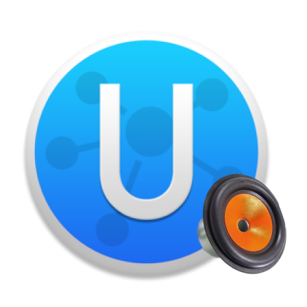
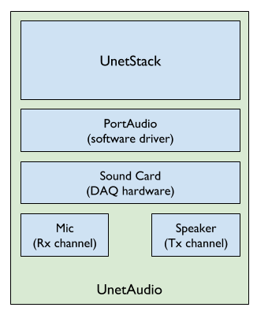
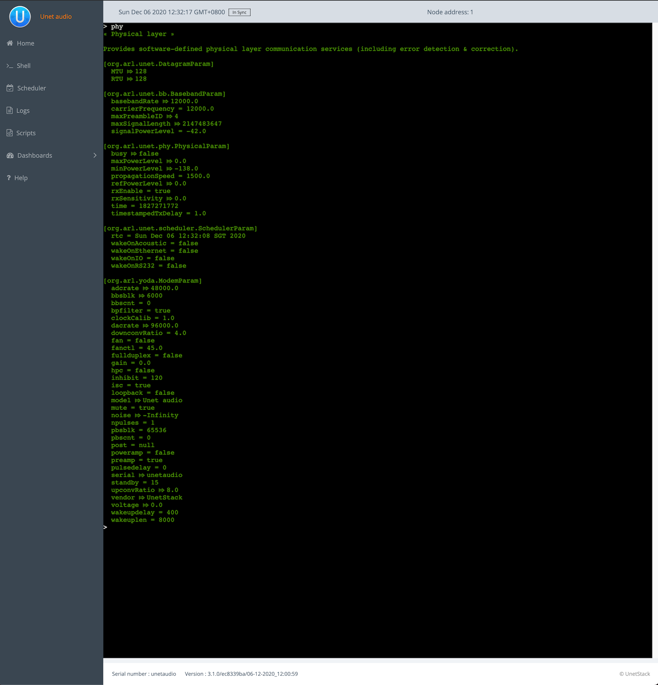

Imagine you are developing an application for an underwater use case such as message or file transfer and you intend to eventually deploy the app on a network of JANUS compliant modems in the field. Or you may be developing a new routing protocol that is intended to work on a network of JANUS compliant modems. Or you might be a university professor designing an exercise for your students to learn about underwater communications and networking.

Along with developing the app or the protocol, a common step is to simulate its performance using simulators like UnetSim. However, before deploying the app on actual modems and going to the field for testing, you want to make sure it works on actual devices as intended. If you are in a classroom, having a hardware component that can actually transmit and receive the frames would be extremely useful. This is where UnetAudio comes handy.

## What is UnetAudio?




**UnetAudio** is one of the software-defined open architecture modems (SDOAMs) that is built using UnetStack technologies that let users convert their laptops or desktops to an acoustic modem. It uses a laptop's sound card along with the speaker and mic as the hardware to transmit and receive data or signals as instructed by the user.



**UnetAudio Block Diagram**

## Running UnetAudio
1. Make sure your computer meets all the prerequisites as listed in below:
- Operating system: OS X / Linux (x86_64)
- Software: Java 8 runtime environment
- Driver: [PortAudio](http://www.portaudio.com/)
- Browser: Chrome 61+ / Firefox 60+ / Safari 10.1+
2. Head to [www.unetstack.net](www.unetstack.net) and download a copy of the UnetStack community edition.
3. Untar the zip file, open a terminal in the download's root folder and type:
```
bin/unet audio
Modem web: http://localhost:8080/
```
4. This should start up the SDOAM and open a browser with a command shell accessing the modem. If the browser does not automatically open, just enter the modem web URL shown above in your browser. At the command shell, you can try transmitting a message:
```
> tell 0, 'hello sea!'
AGREE
```


You should hear the transmission from your computer speaker! If you don’t, check your speaker volume and try again.

## Transmitting & receiving using JANUS protocols

TODO: 

### Using a single laptop
The above examples assume you have two separate machines that you are using as modem. It is also possible to run two instances of UnetAudio in a single machine. However, you will need two separate sound cards to be used for separate modems.

If you are on a mac, once you have connected two sound cards (with mics and speakers) and tested them separately, select the the first sound card by clicking the speaker icon on the top right of your screen. Then open a terminal and start the first instance of UnetAudio. Verify that the correct output is selected by sending a test transmission.

```
> tell 0, 'hello sea!'
AGREE
```

Now, select the second sound card from the top right of the screen as your output device. Open another terminal and start the second instance of UnetAudio. It should automatically use the second sound card as the hardware for this instance. Now you have two instances of UnetAudio running on single machine being able to exchange messages between each other using separate tx & rx channels.

## Advantages of using UnetAudio
### Portability
Even if you happen to own some UnetStack-compatible acoustic modems, testing with a modem means setting up a dedicated test setup, equipment etc. in a confined water body and dealing with the logistics. With UnetAudio, you can test from the comfort of your seat. When you are ready to deploy in a modem, all you have to do is simply copy the code over to the UnetStack-compatible modem and the UnetStack framework takes care of the rest for you.

### Educational tool
Even the cheapest of the underwater acoustic modems comes at a cost and may not be the best option to invest in, if the intended purpose is teaching. UnetAudio community edition is free for academic and research use. Students can use their laptops as modems to learn about underwater communications and networking.

### Support for multiple modulation schemes
UnetAudio supports multiple modulation schemes such as FH-BFSK, JANUS, OFDM that are fully customizable by the user the same way a UnetStack enabled modem is.

### JANUS compatibility
Since we use a sound card as the base hardware, UnetAudio provides as acoustic modem that has a centre frequency of 12 kHz. This is the band of operation where the current JANUS specifications are defined. You can check the various details of the modem by typing the following in the webshell:

```
> phy
```



## Conclusion

UnetAudio provides an easy method for users to convert their laptops or computers to an acoustic modem and get a feel of how things actually happen during a real deployment without incurring any additional cost. It is a great tool for researchers, teachers and students to learn about underwater communications and networking.