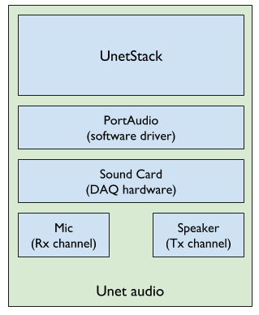
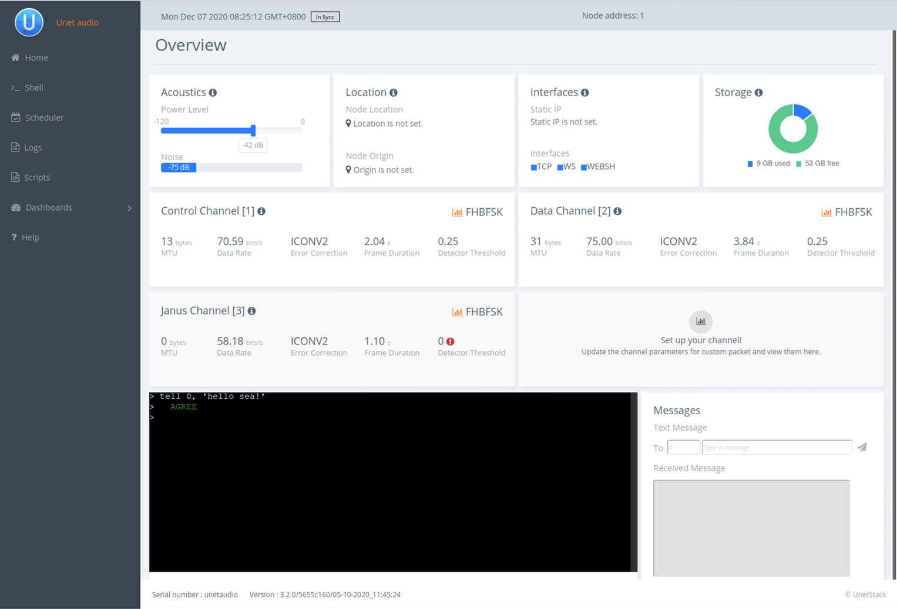

Imagine you are developing an application for an underwater use case such as messaging or file transfer and you intend to eventually deploy the app on a network of [JANUS](http://www.januswiki.com/) compliant modems in the field. Or you may be developing a new routing protocol that is intended to work on a network of JANUS compliant modems. Or you might be a university Professor designing an exercise for your students to learn about underwater communications and networking.

Along with developing the app or the protocol, a common step is to simulate its performance using simulators like [UnetSim](https://unetstack.net/handbook/unet-handbook_getting_started.html#_setting_up_a_simple_simulated_network). However, before deploying the app on actual modems and going to the field for testing, you want to make sure it works on actual devices as intended. If you are in a classroom, having a hardware component that can actually transmit and receive the frames would be extremely useful. This is where [Unet audio](https://unetstack.net/) comes in handy.

## What is Unet audio?


**Unet audio** is one of the software-defined open architecture modems (SDOAMs) that is built using UnetStack technologies that let users convert their computers to an acoustic modem. It uses a computer's sound card (or any sound card attached to a computer) along with its speaker and microphone as the hardware to transmit and receive data or signals as instructed by the user.



**Unet audio Block Diagram**

## Running Unet audio
1. Make sure your computer meets all the prerequisites as listed in below:
- Operating system: OS X / Linux (x86_64)
- Software: Java 8 runtime environment
- Driver: [PortAudio](http://www.portaudio.com/)
- Browser: Chrome 61+ / Firefox 60+ / Safari 10.1+
2. Head to [www.unetstack.net](www.unetstack.net) and download a copy of the UnetStack community edition.
3. Untar the zip file, open a terminal in the download's root folder and type:
```
> bin/unet audio
Modem web: http://localhost:8080/
```
4. This should start up the SDOAM and open a browser with a command shell accessing the modem. If the browser does not automatically open, just enter the modem web URL shown above in your browser. At the command shell, you can try transmitting a message:
```
> tell 0, 'hello sea!'
AGREE
```



You should hear the transmission from your computer speaker! If you don’t, check your speaker volume and try again.

Great, you have just transmitted a message using the default settings of Unet audio.

> NOTE: If you have two computers with speakers and microphones, you can run Unet audio on both, and communicate between the two. If you happen to have only one computer handy,  we can get one Unet audio instance to transmit and receive at the same time as detailed in [section 15.4. Transmitting & receiving using Unet audio](https://unetstack.net/handbook/unet-handbook_physical_service.html) of the [Unet handbook](https://unetstack.net/handbook/unet-handbook_preface.html).


## Transmitting & receiving JANUS frames

The physical layer in Unet audio typically supports 3 logical channels . The first two are used for CONTROL and DATA, and the third, by default, is configured as JANUS. The CONTROL channel uses FH-BFSK (frequency-hopping binary frequency shift keying) by default, which is very close to JANUS, but not exactly the same. Let us take a look at the differences between the two and how to make your transmissions fully JANUS compliant.

If you simply type `phy` on the web shell, you get a list of physical layer parameters for Unet audio:

```
> phy
« Physical layer »

Provides software-defined physical layer communication services (including error detection & correction).

[org.arl.unet.DatagramParam]
  MTU ⤇ 31
  RTU ⤇ 31

[org.arl.unet.phy.PhysicalParam]
  maxPowerLevel ⤇ 0.0
  minPowerLevel ⤇ -138.0
  propagationSpeed = 1500.0
  rxEnable = true

[org.arl.yoda.ModemParam]
  adcrate ⤇ 48000.0
  dacrate ⤇ 96000.0
  fullduplex = false
  loopback = false
  model ⤇ Unet audio
  vendor ⤇ UnetStack
```

> NOTE: For brevity, we have omitted the baseband service, scheduler service parameters and some of the non-relevant parameters in the listings given in this article. Even then, there are many parameters that allow you to configure the SDOAM. We cannot cover each parameter in detail here, but we encourage you to explore the help pages for the parameters by simply typing `help phy` followed by the parameter name.

Unet audio defines three types of frames:

- CONTROL frame = 1
- DATA frame = 2
- JANUS frame = 3

To get the details of each type of frame, you can use indexed parameters. For getting the details of CONTROL channel, type `phy[1]`.

```
> phy[1]
« PHY »

[org.arl.unet.phy.PhysicalChannelParam]
  dataRate ⤇ 70.588234
  errorDetection ⤇ true
  fec = 1
  fecList ⤇ [ICONV2]
  frameDuration ⤇ 2.04
  frameLength = 18
  janus = false

[org.arl.yoda.FhbfskParam]
  chiplen = 1
  fmin = 9520.0
  fstep = 160.0
  hops = 13
  scrambler = 0
  sync = true
  tukey = true
```

Similarly, typing `phy[3]` will list the parameters of JANUS frame.

```
> phy[3]
« PHY »

[org.arl.unet.phy.PhysicalChannelParam]
  dataRate ⤇ 58.181816
  errorDetection ⤇ true
  fec = 1
  fecList ⤇ [ICONV2]
  frameDuration ⤇ 1.1
  frameLength = 8
  janus = true

[org.arl.yoda.FhbfskParam]
  chiplen = 1
  fmin = 9520.0
  fstep = 160.0
  hops = 13
  scrambler = 0
  sync = true
  tukey = true
```

The first difference you will notice between the three is the `phy.janus` parameter which is set to `false` for the CONTROL channel and `true` for JANUS channel. The settings `phy.janus` &  `modulation = fhbfsk` sets up the modulation for JANUS.

The other key parameters to take note of:
- `fmin = 9520.0`, `fstep = 160.0` and `hops = 13` are the modulation parameters to setup `fhbfsk` as required by JANUS.
- `fec = 7` chooses `ICONV2` from the `fecList`, as required by JANUS
- `threshold = 0.0` indicates that reception of JANUS frames is disabled

Notice how they are different between the CONTROL channel and the JANUS channel. As a result, the data rate provided by the CONTROL channel is different from that of the JANUS channel.

To enable JANUS reception, you need to set:
```
> phy[3].threshold = 0.3
```

> NOTE: To avoid detection for other type of frames, you can disable the other two channels by setting the `threshold` to zero.

Now comes the most exciting part – communicating between two computers using JANUS with Unet audio. First you need to setup you receiving computer to generate notification after a reception by typing:

```
subscribe phy
```
This will show notifications from `phy` on the shell.

Next, you can make a JANUS transmission by typing:

```
> phy << new TxJanusFrameReq()
AGREE
phy >> TxFrameNtf:INFORM[type:#3 txTime:127730682]
```

This will transmit a broadcast JANUS frame.

On the receiving computer, you should see:

```
phy >> RxFrameStartNtf:INFORM[type:#3 rxTime:127730375 rxDuration:1100000 detector:0.96]
phy >> RxJanusFrameNtf:INFORM[type:#3 classUserID:0 appType:0 appData:0 mobility:false canForward:true txRxFlag:true rxTime:127730374 rssi:-44.2 cfo:0.0]
```

> NOTE: The JANUS frame format doesn’t contain user data by default, and so the MTU is 0 (`frameLength` of 8 as defined in JANUS specifications). JANUS allows vendors to provide their own “cargo”, and so UnetStack lets you increase the `frameLength` to make space for user data (`MTU`).


If you would like to add a payload, you can increase the `phy.frameLength` parameter (default is 8). Let us transmit 1 byte of data.

```
> phy[3].frameLength=9
9
```

Data can be added to the transmission by typing:
```
> phy << new TxJanusFrameReq(data:[1])
AGREE
phy >> TxFrameNtf:INFORM[type:#3 txTime:1754760016]
```

On the receiving side:

```
> phy << new TxJanusFrameReq(data:[1])
AGREE
phy >> RxFrameStartNtf:INFORM[type:#3 rxTime:1754759709 rxDuration:1300000 detector:0.96]
phy >> RxJanusFrameNtf:INFORM[type:#3 classUserID:0 appType:0 appData:0 mobility:false canForward:true txRxFlag:true reservationDuration:0.15031052 rxTime:1754759708 rssi:-44.3 cfo:0.0 (1 byte)]
```


You can check the content of the received frame by typing:
```
> ntf.data
[1]
```

It is that simple to set up an SODAM on your laptop/computer and transmit and receive acoustic communication signals using Unet audio.


## Conclusion

Unet audio provides an easy method for researchers, teachers and students to convert their computers to a JANUS compliant SDOAM. Even the cheapest of the underwater acoustic modems comes at a cost and may not be the best option to invest in, if the intended purpose is teaching. Unet audio community edition is free for academic and research use.

Even if you happen to own some UnetStack compatible acoustic modems, testing with a modem means setting up a dedicated test setup & equipment, access to a water body and dealing with the logistics. With Unet audio, you can develop and test from the comfort of your seat. Additionally, Unet audio provides an SDOAM that covers the frequency band of operation as defined by the JANUS specifications.

This post only gives you a glimpse of how you can do JANUS transmissions and receptions using Unet audio. There are many more interesting things you can do like transmit and receive the raw baseband signals from a `*.wav` file and plot a spectrogram to verify the signal is indeed JANUS compliant ([as illustrated here](https://stackoverflow.com/questions/65027940/how-do-i-record-janus-signal-as-wav-file)), or setup a network of SDOAMs that uses JANUS as their physical layer.
