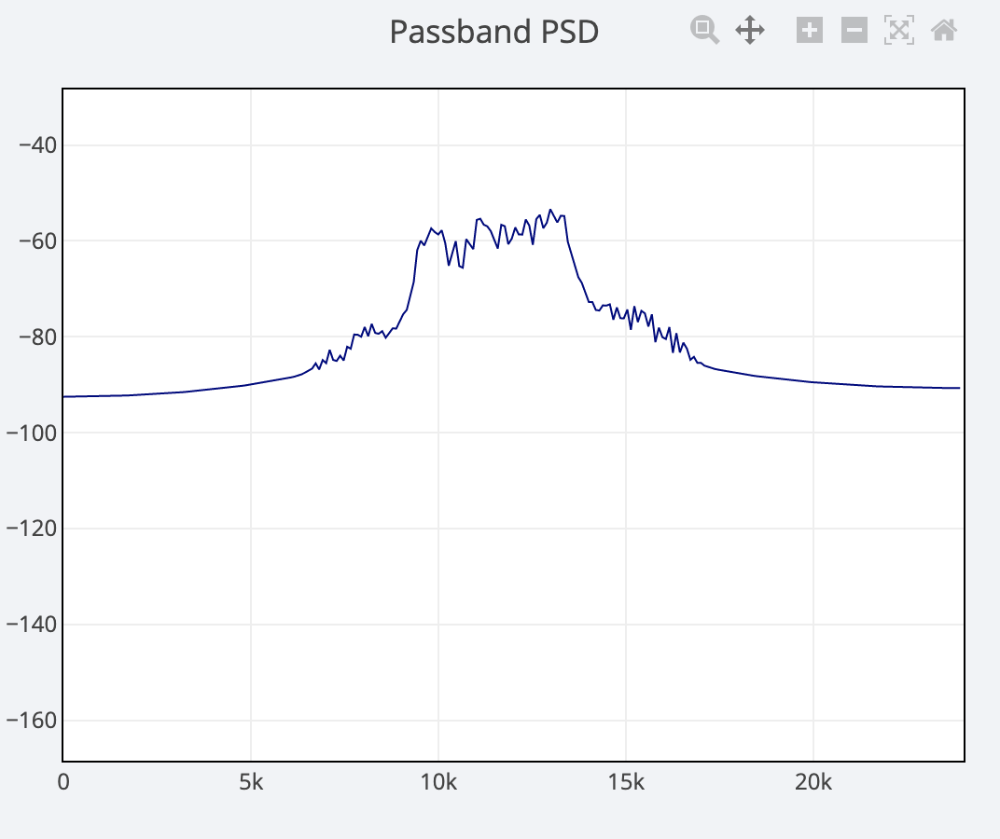
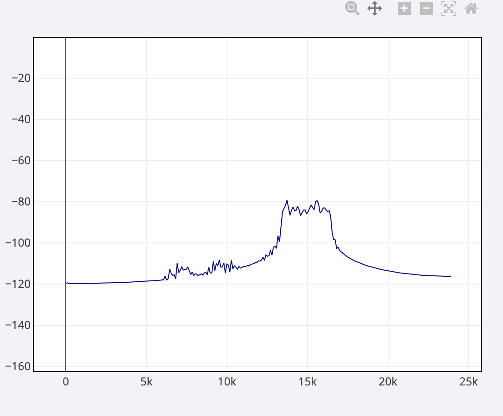

### The need to control center frequency and bandwidth 

Acoustic modems transmit physical sound waves via a transducer, typically a piezoelectric device. Such sound emitters have an ideal resonance frequency *F* and a *Q* factor of the order of 0.3. This means that the efficient region of the frequencies it can transmit centers around the resonance frequency with a bandwidth of about *0.3 x F*. *Q* may be higher or lower depending on the exact transducer.

The transducer in the Subnero [M25M series](https://subnero.com/products/modem.html) modems has a resonance close to 26 kHz. The computationally possible bandwidth is 24 kHz, but not all of this bandwidth is feasible for the transducer. Thus the recommended default bandwidth is B = 12 kHz, which is half of the total possible. Thus an effective transmit modulation scheme can be set such that the center *C = 26 kHz* and *B = 12 kHz*.

Another reason may be due to acoustic underwater channel characteristics. A most basic property is that higher frequencies get absorbed more and in general have a lower transmission range. For this or other reasons related to the channel, the modem user may want to customize the frequencies transmitted by the modem. 

Multiple Access is another case where users may want to control the band used in each modem. One common multiple access method is Frequency Domain Multiple Access (FDMA). In this scheme, different modems or modem pairs may be allocated a different frequency band for transmission to avoid a collision. Simultaneous transmission-reception by two or more different and colocated modem pairs is possible using FDMA. 

Sometimes, there may be a frequency band the user may want to exclude from usage, due to it being occupied by other sources, noise, etc. 

> The reader may wish to install Unet audio and try out some basic examples in the following sections. 

## OFDM frequency band control

OFDM is one of the main modulation schemes provided with UnetStack-based modems. It is the default DATA channel in UnetStack modems. Controlling the bandwidth and center of the frequency band used is very simple for this scheme.

OFDM uses several carriers to modulate the baseband data and the number is specified via `phy[2].nc`. These carriers span the total available bandwidth (24 kHz for Medium Frequency Subnero modem variants), i.e., from 12 kHz to 36 kHz. 

The parameter `phy[2].bw`. controls a reduction in the usage of this total bandwidth. I.e., if we specify `phy[2].bw = 0.5`, it reduces the bandwidth used by half, i.e, 24 kHz / 2 = 12 kHz. 

The other parameter involved in bandwidth control is `phy[2].dc0`. This controls the starting carrier number. 

`dc0 >= -nc/2 || dc0 <= nc/2`

This can be used to shift the center of the frequency band "left" or "right". 

As mentioned above, to set the band to match the transducer, we need C = 26 kHz and B = 12 kHz.

The default modem parameters are set as follows to achieve this.

```
> phy[2]
  ...
  bw = 0.5
  dc0 = 85
  nc = 1024
```

`phy.dc0=85` shifts the center by approximately 2000 Hz. Carriers go from -512 to +512 to span the band from 12 kHz to 36 kHz. *85/512 ~= 1/6*, so the center will shift roughly by 1/6 of 12 kHz = 2000 Hz (the positive half band) to 26 kHz from 24 kHz.


`phy[2].bw = 0.5` will reduce the active carriers by half, so a bandwidth of 12 kHz. Thus together, the used bandwidth will go from 20kHz to 32kHz.

For Unet audio, the same settings will shift the center by 1 kHz to 13 kHz with a bandwidth of 6 kHz. Therefore from 10kHz to 16kHz, this is seen below (`plvl = -25`, trigger -70, may vary for user).


Note that if there is a frequency band to be avoided, we can position the used band to the "left" or "right" of it by adjusting `nc`, `dc0`, and `bw`. Note that going far away from the ideal transducer resonance region will reduce transmission efficiency. 

The usage and meaning of parameters can be found in [Command Reference](https://unetstack.net/handbook/unet-handbook.html#_command_reference)

## FHBFSK frequency band control

For FHBFSK scheme, the parameter `phy[3].fmin` specifies the starting frequency. `phy[3].fstep` specifies the frequency steps and `phy[3].hops` the total number of frequencies used. 

By default, you may see in the Unet audio modem 

```
> phy[3]
  ...
  fmin = 9520.0
  fstep = 160.0
  hops = 13
```

So it starts from 9520 Hz and goes to *9520 + 160 x (13-1) x 2  = 13360 Hz* as seen below. 
The effective bandwidth can be roughly taken as *fstep x hops x 2*.



We can alter the above parameters to use a band anywhere between 6 kHz and 18 kHz, which is the computationally feasible band of the Unet audio modem. 

Note that just as in OFDM, if there is a frequency band to be avoided, we can position the used band to the "left" or "right" of it by adjusting `fmin`, `fstep` and `hops`.

The default CONTROL channel in UnetStack-based modems is such an FHBFSK scheme.

## Control of Preamble bandwidth

To complete the picture of bandwidth control, it must be noted that the signal that is transmitted not only has a data modulated portion, but also a detection preamble at the start. This is usually a signal that has good autocorrelation properties like a pseudo-random noise signal or m-sequences, hyperbolic chirp (HFM), etc.

The [`Preamble` class](https://unetstack.net/javadoc/3.3/org/arl/yoda/Preamble.html) provides both the above types of preambles via the methods such as `mseq(..)`, `hfmUpSweep(..)`, `hfmDownSweep(..)`. It allows controlling the bandwidth and center frequency of the preamble.

Let's look at one of them

```
public static Preamble hfmDownSweep(int len, int sps, float fc)
```

- `len` is the number of baseband samples
- `sps` controls the bandwidth
  Preamble bandwidth = baseband bandwidth/sps. Note that sps must be an integer.
  Thus for Unet audio, `sps = 4` creates a bandwidth of *12 kHz / 4 = 3 kHz*.
- `fc` controls the center frequency. This is normalized to the baseband rate. So for Unet audio, `fc = 0.25` will shift the carrier by *12 kHz x 0.25 = 3 kHz*. i.e., from 12 kHz to 15 kHz. 

E.g., the following creates an HFM down sweep signal with 1000 baseband samples, a bandwidth of 3 kHz, centered at 15 kHz.

```
> phy[3].preamble = org.arl.yoda.Preamble.hfmDownSweep(1000, 4, 0.25)
(1000 samples)

```
To transmit this preamble alone (with no additional signal)

```
> phy << new TxBasebandSignalReq(preamble: 3)
```

In the Diagnostic Scope dashboard, let us look at the passband PSD. With an appropriate trigger, you may get something as follows. It clearly shows the center of 15 kHz and the bandwidth of 3 kHz.



The user can also generate and set custom preambles. 

> NOTE: Details of the custom preamble are available in section 16.4. Transmitting and detecting preambles` of the [Unet handbook](https://unetstack.net/handbook/unet-handbook_baseband_service.html).


## Conclusion

There is a need to control the frequency band of operation in acoustic modems and we have seen how easy it is to control it in both OFDM and FHBFSK schemes in the UnetStack-based modems.
