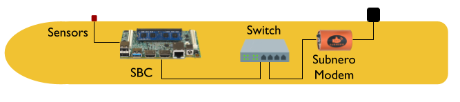
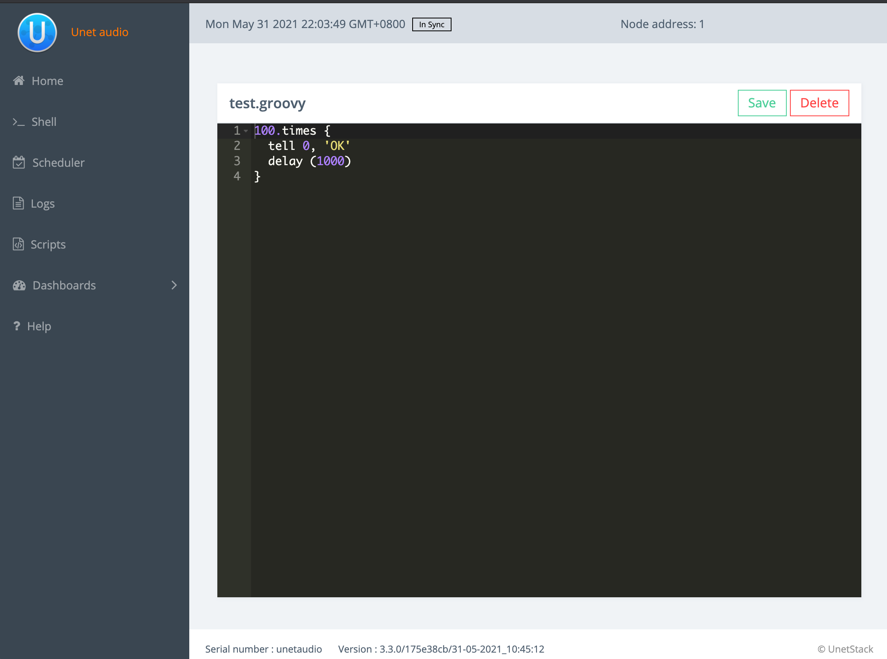

UnetStack powered acoustic modems provide extreme flexibility to the user to automate processes such as the transmission of data frames (e.g. position updates) or signals, decision making after the reception, etc. enabling a hands-off approach to test various deployment scenarios. If you are using a program or a script to transmit and receive from your software-defined open architecture acoustic modem (SDOAM), it is often good to know your location (latitude, longitude, and depth), to make decisions such as when to transmit, what power level to use, etc. This is not a big problem if your acoustic modem is deployed in a fixed location. However, if the modem is installed in a mobile underwater asset like an autonomous underwater vehicle (AUV), such decisions are crucial.

Since transducers are electromechanical devices, transmitting at high power closer to the water surface will cause cavitation that will result in a bad communication link. This may even damage the transducer. Additionally, if you are close to a receiving modem, transmitting at high power may saturate the receiver thereby causing the receiver to not being able to decipher your messages.

Some SDOAMs like the Subnero modems in [standalone configuration](https://subnero.com/products/wnc-m25mss3.html) come with a depth sensor (with the option to add more sensors like [GPS, compass](https://subnero.com/products/sensors.html) etc.). Let us take a look at how a user would use this information to decide when to transmit and when not to, from a modem that is installed in an AUV.

<p align="center"></p>
<p align="center">Figure 1: AUV internal connection</p>


Figure 1 shows our assumptions on how the various components are connected within the AUV for this article. A single-board computer (SBC) in the AUV is connected to the modem over an Ethernet interface. Both the AUV's SBC and the modem are in the same network.

To start with, let us assume the user would like to send periodic updates from AUV as a broadcast message. There are mainly two ways to do this.

1. Run a program in the SBC and connect to the modem using a UnetStack Gateway to send periodic commands to the modem, using Unet socket APIs. This can be done using any of the programming languages supported by UnetStack such as C, Java, Groovy, Python, Julia, etc. as detailed [here](https://unetstack.net/handbook/unet-handbook_unetsocket_api.html). In this case, the user has access to various sensors of the AUV directly.
2. Running a groovy script in the modem to do the periodic transmissions. The advantage of this method is that you now have direct access to the modem and can deploy your own [fjåge](https://github.com/org-arl/fjage) agents. This is a lot more flexible as compared to what is offered by the APIs.

To send a simple broadcast message once, you can use the `tell` command as follows.

```groovy
tell 0, 'OK'
```

To execute this from a script, you can create a new file from the `scripts` tab in the UnetStack's web interface.

<p align="center"></p>
<p align="center">Figure 2. UnetStack's web interface</p>


To repeat this 100 times, once every second, the script can be updated to:

```groovy
100.times {
  tell 0, 'OK'
  delay (1000)
}
```

The next step is to determine the current depth at which the device is, then decide whether to transmit or not.

In UnetStack, the `NODE_INFO` service provides a single place to collate node-related information that is commonly needed by many agents. One of the parameters of this service is the `location` which tracks the location of the modem are (x, y, z) in meters if the `origin` set, otherwise (latitude, longitude, z). If your modem has a depth sensor, the `z` value of `node.location` contains the depth information. You can update the script to transmit only at a depth less than -2 m, as follows.

```groovy
100.times {
    depth = node.location[2]
    if (depth < -2) tell 0, 'OK'
    delay(1000)
}
```

> NOTE: Depth is indicated as 0 (at water surface), -1 (1 m below the water surface), -2 (2 m below the water surface), and so on. See [Section 5.6](https://unetstack.net/handbook/unet-handbook_setting_up_small_networks.html#_node_locations_coordinate_systems) of the unet handbook for a discussion on origin, location, and coordinate systems.

What if your modem does not have a depth sensor (e.g. [embedded configuration](https://subnero.com/products/wnc-m25mse3.html)) and you would like to use the sensor data from your AUV? In this case, you will have to run a program in the AUV's SBC to get the location data from AUV's sensors and use Unet socket APIs to update the `node.location` parameter, periodically. A pseudo-code (in python) for doing this is as follows. 

```python
from unetpy import *
import time

port = 1100
ip_address = 'modem IP'

# Open a unet socket connection to modem
sock = UnetSocket(ip_address, port)

# Get the agent which provide NODE_INFO service
node = sock.agentForService(Services.NODE_INFO)

# Update depth when available
while get_auv_depth() < 0:
  depth = get_auv_depth()
  lat = get_auv_lat()
  lon = get_auv_lon()
  node.location=[lat, lon, depth]
  time.sleep(1)

# Close the socket
sock.close()
```

The above code can easily be adapted in other languages such as C. A pseudo-code (in C) for the same is as follows:

```c
#define BUF_SIZE 12

unetsocket_t sock;
fjage_aid_t node;
int port = 1100
const char* ip_address = 'modem IP'

// Open a unet socket connection to modem
sock = unetsocket_open(ip_address, port);
fjage_gw_t gw = unetsocket_get_gateway(sock);

// Get the agent which provides SHELL service
fjage_aid_t aid = unetsocket_agent_for_service(sock, "org.arl.fjage.shell.Services.SHELL");

// Update depth when available
while (get_auv_depth() < 0) {

  // NOTE: get_auv_depth(), get_auv_lat(), get_auv_lon() to be implemented by user
  char depth[BUF_SIZE] = {0};
  char lat[BUF_SIZE] = {0};
  char lon[BUF_SIZE] = {0};
  snprintf(depth, BUF_SIZE, "%f", get_auv_depth());
  snprintf(lat, BUF_SIZE, "%f", get_auv_lat());
  snprintf(lon, BUF_SIZE, "%f", get_auv_lon());
  
  char* cmd;
  asprintf(&cmd, "node.location=[%s, %s, %s]", lat, lon, depth);
  fjage_msg_t msg = fjage_msg_create("org.arl.fjage.shell.ShellExecReq", FJAGE_REQUEST);
  fjage_msg_set_recipient(msg, aid);
  fjage_msg_add_string(msg, "cmd", cmd);
  fjage_msg_t rsp = fjage_request(gw, msg, 1000);
  if (rsp != NULL) fjage_msg_destroy(rsp);
  free(cmd);
}

fjage_aid_destroy(aid);

// Close the socket
unetsocket_close(sock);
```

> NOTE: The user will have to replace the above code with appropriate function calls to get the AUV sensor data.

The above examples can easily be adapted to check the range to a receiver (using [`range`](https://unetstack.net/handbook/unet-handbook_ranging_and_synchronization.html) command) and adjust the transmit power level accordingly, to avoid saturating a receiver.

## Conclusion

While acoustic modems were traditionally used as simple devices to transmit and receive data, UnetStack enabled SDOAMs to provide features to intelligently manage transmission and reception of data frames as well as signals based on various deployment scenarios.
