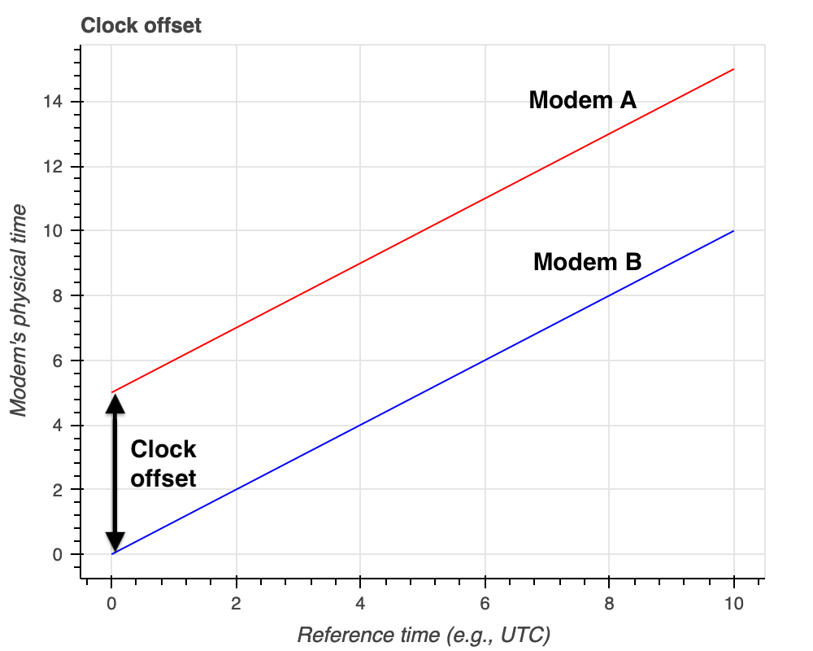
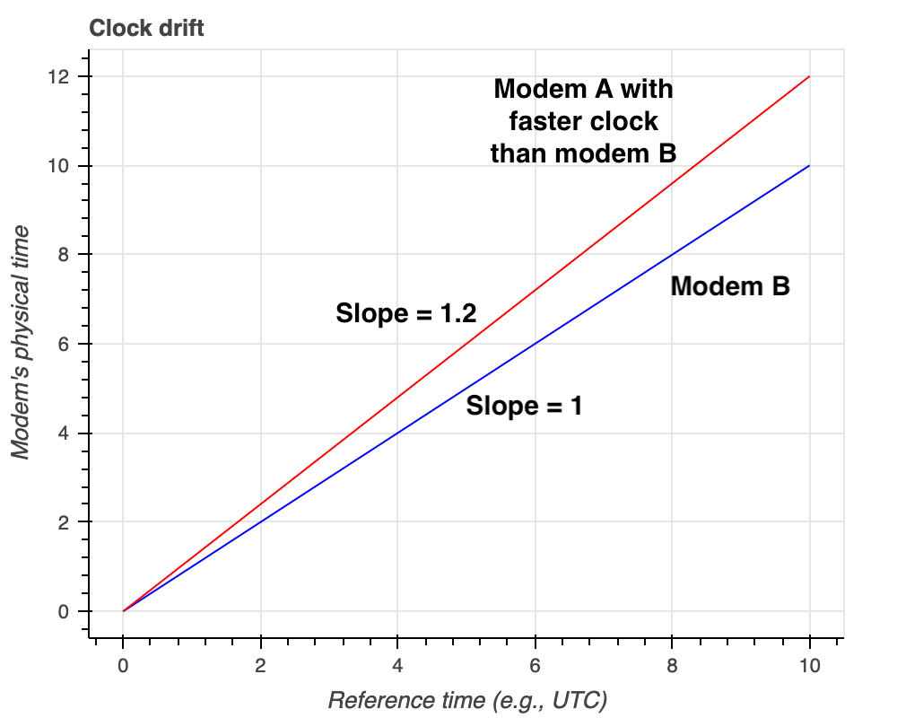

All UnetStack enabled modems have a Real-time Clock (RTC) to keep track of time using a precise quartz crystal. Based on the defined frequency of this quartz, software running on the modem can precisely monitor the internal physical time given by parameter `phy.time` in the modem. 

Although this frequency of the crystal quartz is reasonably stable, it is impossible to guarantee that all the crystals of different computers will operate at _exactly_ the same frequency. A crystal oscillator (XO) is an electronic circuit that uses the mechanical resonance of a vibrating piezoelectric crystal to create an electrical signal with the desired frequency. The resonant frequency depends on size, shape, elasticity, and the speed of sound in the material. Due to manufacturing tolerances, these properties are not identical across manufactured crystals, and so different crystals designed for the same nominal frequency produce slightly different frequency signals. Furthermore, as the operating temperature of the crystal changes, its material properties change, and so does its resonant frequency. These differences in frequency are tiny, but over long periods, the differences accumulate and cause the clocks to drift.

There are different oscillator types that exist to chose from including OCXOs, TCXOs, and XOs. The crystal controlled clock oscillator (XO) is a device that achieves its temperature stability from the quartz crystal's inherent temperature stability.
A temperature compensated crystal oscillator (TCXO) is a crystal oscillator with a temperature-sensitive reactance circuit in its oscillation loop to compensate the frequency-temperature characteristics inherent to the crystal unit. An OCXO is a crystal oscillator which is temperature controlled by a mini internal oven. This type of oscillator has a temperature controlling circuit to maintain a consistent temperature of the crystal and other key components. OCXOs are typically used when greater temperature stability is required. While this type of oscillator has a tenfold improvement over a TCXO for temperature vs. frequency stability, the OCXO tends to be higher in price and consumes more power.

> NOTE: For example, UnetStack-based Subnero modems can be optionally upgraded to use [low-drift clocks](https://subnero.com/products/sensors.html). Such clocks provide much better time stability and are suitable for such applications where time synchronization over long periods of time is critical.

Now, when there is a possibility of clock drift, it is not easy for having multiple spatially separated modems with synchronized physical clocks. So the question arises, if the synchronization of physical clocks across different UnetStack enabled modems is needed, how do we synchronize them with each other?

There are two major problems to be addressed to synchronize clocks among different modems:

1. Modems start at different times so there may be a *clock offset* as shown in figure below:



2. Modem clocks tick at different rates causing a *clock drift* as shown in figure below:



> NOTE: The 20% clock drift shown in the figure is for illustration purpose only. In practice, the clock drift is expected to be much smaller in parts per million.

# Compensating for clock offset

The `Ranging` agent in UnetStack running on the modem generates the clock offset information based on the message exchanges when range measurement is performed on the modem that initiates ranging. The clock offset between the two modems is populated in the ranging agent's parameter `ranging[host('B')].offset`. Where `host('B')` is the node address of modem B. More details on this can be found [here](https://unetstack.net/handbook/unet-handbook_ranging_and_synchronization.html). 

Once, the clock offset is known, it can be used to adjust the time locally to synchronize the physical time (`phy.time`). However, if a low-drift clock is not used, there is a possibility that the clocks tick at different rates, and clocks drift faster. Let us take a look at how we can compensate for the clock drift next.

# Compensating for clock drift

Since the modems might tick at different rates, one modem's clock may be faster than the other. An example is shown in the figure above where Modem A's clock is faster than Modem B, i.e., a slope of 1.2 on Modem A's clock. To compensate for this, the user of the modem can utilize a `phy.clockCalib` parameter. This parameter is a multiplier on the physical clock. So its default value is 1. If you set it to 1.2 the clock will run at 1.2x the rate of the actual hardware clock.

Therefore, to compensate Modem A's clock to run slower so that it matches Modem B's clock, we can set `phy.clockCalib = 1/1.2 = 0.83`.


The users of the modem should make measurements to figure out the nomimal values that they should set for `phy.clockCalib`. 

# An example of calibrating clock

We will consider two modems A and B for this example. To synchronize modem A's clock with the modem B's clock the following procedure may be followed:

1.  Make a measurement of _system time_ and _physical clock time_ on modem A.

To measure system time, open modem's web shell and type the following:

```groovy
> phy.rtc.getTime()

```

To measure physical clock time, open modem's web shell and type the following:

```groovy
> phy.time

```

`phy.rtc.getTime()` returns the number of milliseconds since January 1, 1970, 00:00:00 GMT represented by this `Date` object (`phy.rtc`). The `phy.time` returns time in microseconds. Make a record of both these measurements in the same unit.


2. Repeat Step 1 after 1 hour and make another measurement. This step should be repeated hourly until the desired number of hours.

3. Plot a graph with measurements of _system time_ on x-axis and _physical clock time_ on y-axis. 

4. Fit a straight line among these measurements.

5. Compute the slope of the line, say `mA`.

6. Repeat Steps 1-5 on modem B.

7. Compute the slope of the line, say `mB`.

8. To match the clocks to tick at the same rate, set modem A's clock calibration parameter to following:

```groovy
phy.clockCalib = mB/mA

```

We show here a simple code snippet to run on two modems (say A & B) to measure the slope and compute the calibration factor to set `phy.clockCalib` parameter. The code presented makes measurements every hour and runs for 24 hours.


_On modem A_:

```groovy
def interval = 3600*1000 // 1 hour in ms
def noOfMeasurments = 24
def phy = agent('phy')
def systime = []
def phytime = []
noOfMeasurments.times {
	systime.append(phy.rtc.getTime())
	phytime.append(phy.time/1000)
	delay(interval)
}
// compute slope based on measurements
mA = (phytime[noOfMeasurments-1] - phytime[0])/(systime[noOfMeasurments-1] - systime[0]) 
```

_On modem B_:

```groovy
def interval = 3600*1000 // 1 hour in ms
def noOfMeasurments = 24
def phy = agent('phy')
def systime = []
def phytime = []
noOfMeasurments.times {
	systime.append(phy.rtc.getTime())
	phytime.append(phy.time/1000)
	delay(interval)
}
// compute slope based on measurements
mB = (phytime[noOfMeasurments-1] - phytime[0])/(systime[noOfMeasurments-1] - systime[0]) // slope
```

Now, based on the computed slopes (mA and mB), the modem A's clock can be set to the following to match the clocks to tick at the same rate:

```groovy
phy.clockCalib = mB/mA

```

# Calibrating clock without relying on RTC

It is possible that the RTC is no more accurate than the physical clock. In that case, it is obvious that it should not be used as a reference time source. Instead, we can measure and compare the clocks of the two modems directly. In this section, we describe through a simple python script on how one can achieve this. 

_On user's machine_:

```python
import time
from unetpy import *

# open a UnetSocket to modem A
modemA = UnetSocket("modemA-IP", 1100)

# open a UnetSocket to modem B
modemB = UnetSocket("modemB-IP", 1100)

# get physical agent ids on modem A and B
phyA = modemA.agent("phy")
phyB = modemB.agent("phy")

# measure phy.time on both modem A and modem B

interval = 3600 # 1 hour in seconds

noOfMeasurements = 24

phytimeA = []
phytimeB = []

for i in range(noOfMeasurements):
	phytimeA.append(phyA.time)
	phytimeB.append(phyB.time)
	time.sleep(interval)

# compute slope based on measurements
m = (phytimeB[noOfMeasurments-1] - phytimeB[0])/(phytimeA[noOfMeasurments-1] - phytimeA[0]) // slope
```
Now based on the computed slope (m), the modem A or modem B's `clockCalib` parameter can be set accordingly to match the other modem's clock as explained in previous section. 

Note the parameters used in the all the above code snippets such as `interval` and `noOfMeasurements` can be varied as per the user's need. The code snippets shown in this blog is to serve as a reference only.

