## Introduction
In the article titled [Converting your laptop into a JANUS modem using Unet audio](https://blog.unetstack.net/converting-your-laptop-into-a-janus-modem-using-unetaudio), we saw how UnetStack, a Software-Defined Open Architecture Modem (SDOAM), can be used to turn your laptop into an acoustic modem. A true SDOAM can easily be extended to run on various hardware platforms with different types of physical layers (e.g. Acoustic, optical, RF) with minimal efforts to address different use cases. In this article, we will show how you can build a low-cost (< USD 300) , DIY underwater acoustic modem using only Commercial Off-The-Shelf (COTS) components and Unet audio. The goal of this article is to demonstrate the approach and basic steps one can use to build a low cost acoustic modem using Unet audio. We encourage the reader to build on these principles to build your own versions of the DIY modem.

## Motivation and Approach
Most commercially available modems are beyond the reach of a technology enthusiast or a hobbyist underwater roboticist, due to their price point. However, applications such as DIY underwater vehicles (e.g. for [The Singapore AUV Challenge](https://sauvc.org/)), low-cost swarms, etc. need low-cost underwater modems to realize their true potential. While there have been projects like the [AHOI modem](https://dl.acm.org/doi/10.1145/3376921), [SeaModem](https://ieeexplore.ieee.org/document/7271721), [Seatrac](https://ieeexplore.ieee.org/document/7271578), all of them have custom hardware associated with them. This means the user needs to spend time building the hardware, which can be cumbersome and time-consuming. Adding additional hardware to a micro-AUV can be challenging due to space and power limitations. Ensuring long-term support for these can also be tricky, depending on the creator's other commitments.

These are some of the challenges for anyone looking to use one of the existing projects to build on.

Unet audio being a true SDOAM addresses these by using a commonly available hardware platform such as Raspberry Pi and using its sound card to transmit and receive using an underwater speaker and microphone. This approach allows the user to run Unet audio in their single board computer (SBC) thereby avoiding the need for dedicated digital hardware (e.g. SBC, FPGA). The audio amplifiers can then be chosen based on the use case. By using Unet audio, the user gets access to all the developer tools and the extendability to build their protocols on top of the DIY modem. Long term support is guaranteed since UnetStack is actively developed by both academia ([ARL](http://arl.nus.edu.sg/)) and industry ([Subnero](https://subnero.com/)).

## Overview of the DIY modem

A modem has three main functions

1. Convert user-given data to a signal and transmit it to the receiver.
2. Decode the signal received at the receiver to recover the original data.
3. Configure various parameters to get the best communication performance.

To transmit a message, the user can use the various interfaces provided by Unet audio such as the web interface, shell, or various APIs in a variety of computer languages such as Java, Groovy, Python, C, Julia, Javascript, etc. The same interfaces can be used to configure various communication parameters to achieve the best performance in a given environment.

> NOTE: UnetStack refers to a collection of technologies for extending networks underwater of which Unet audio is one of the components. An interested user may refer to the [Unet handbook](https://unetstack.net/handbook/unet-handbook_unet_basics.html) to gain a deeper understanding of it.

The user-provided data is then converted to passband signals in Unet audio. This includes transport and network layer processing (as required), fragmentation and reassembly, forward error correction (FEC), modulation, and demodulation depending on the communication scheme used. The passband signal (digital) is then converted to an analog signal using a sound card and passed through a power amplifier before being fed to the transducer/underwater speaker for transmission through the medium.

On the receive side, the signal is received using a hydrophone/underwater mic, converted to a digital signal using a sound card's mic in port, and digitally processed to detect and decode the data from the signal using Unet audio. On successful decoding, the data is passed back to the user. If the decoding fails, an appropriate notification is provided to the user.

So the main hardware components of an SDOAM will be an SBC to run Unet audio, a sound card (with speaker out and mic in), audio amplifiers, and speaker and mic. The following sections list the hardware chain for both the transmit and receive chains.

### Transmit chain

Connect the speaker output from the sound card (either a discrete or USB sound card connected to an SBC) to the amplifier module input. The amplifier output is then connected to the underwater speaker. Depending on the amplifier used, it can be powered using the USB output of the RPi or a 12V battery.

<p align="center">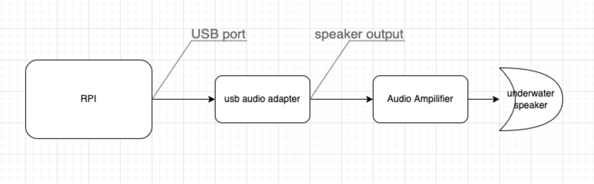</p>
<p align="center"><em>Transmit chain</em></p>

### Receive chain

For the receiver side, the underwater microphone is connected directly to the mic in of the soundcard of the SBC.

<p align="center">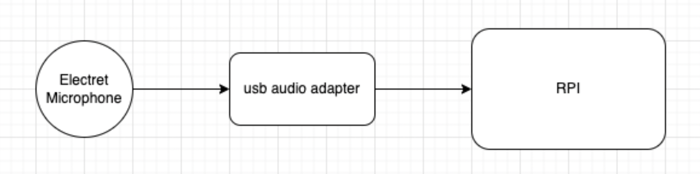</p>
<p align="center"><em>Receive chain</em></p>


## Hardware Selection


### Digital Hardware

One of the most important hardware components of an SDOAM is the digital hardware that runs Unet audio. We have selected a Raspberry Pi (3b+) due to its popularity, low cost, ease of availability, and community support to be the digital hardware to run Unet audio. This can easily be swapped with any similar SBCs that have an arm processor running Linux on it. A [USB sound card](https://www.aliexpress.com/item/4000598865391.html) connected to the Raspberry Pi is used as the data acquisition system.

> NOTE: The internal audio output was not used as it is disabled by default during setup.

<p align="center">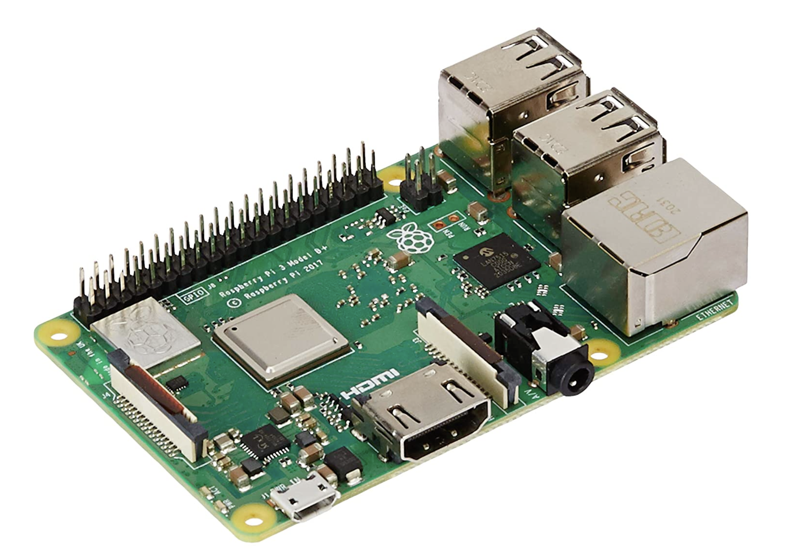</p>
<p align="center"><em>Raspberry Pi</em></p>


<p align="center">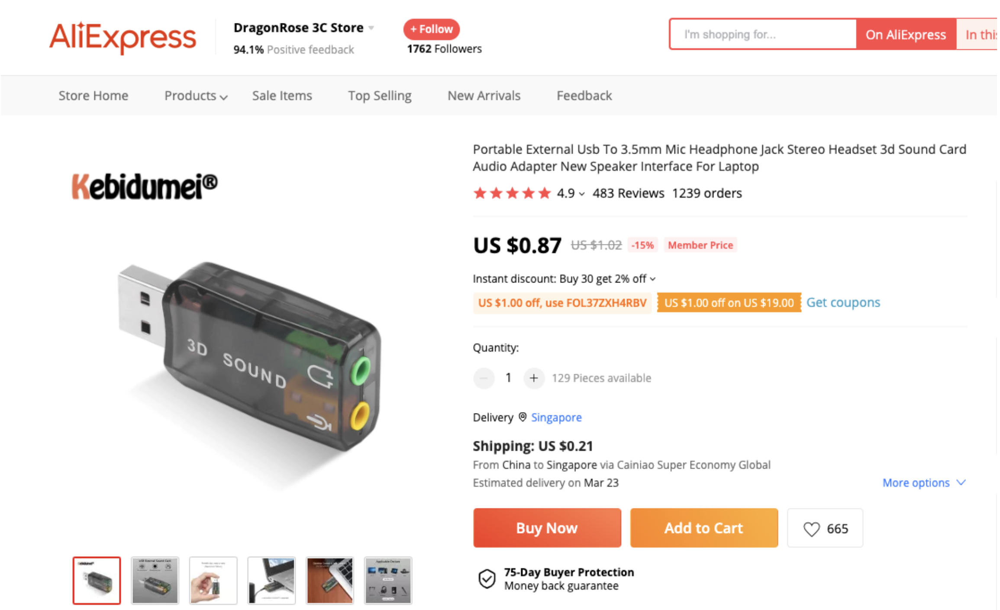</p>
<p align="center"><em>USB soundcard</em></p>

### Transmit Chain

The next step is the selection of the amplifier and the transducer/underwater speaker. To keep the costs down, we have chosen an underwater speaker [JH001](http://www.jiaxiangwang.com/spen/product.htm) for the transmitter.

<p align="center">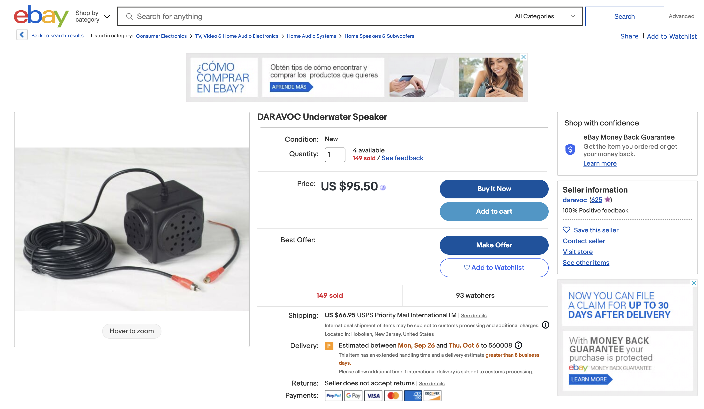</p>
<p align="center"><em>JH001 Underwater Speaker</em></p>

Most standard TDA series (e.g. TDA2030) mono amplifiers should work fine as the audio amplifier. We have selected the TDA2030A for use with our DIY setup. The user may choose an amplifier that meets your application.


<p align="center">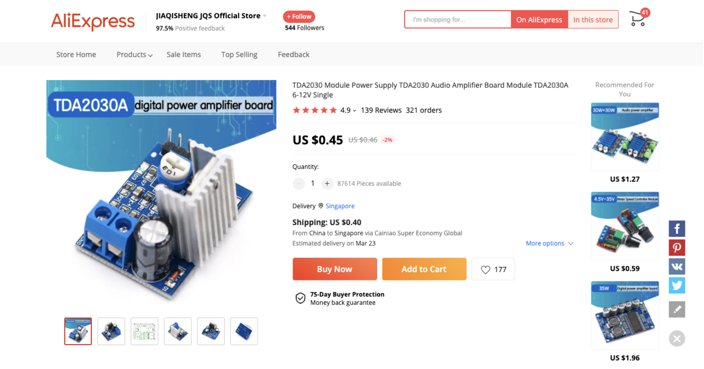</p>
<p align="center"><em>Power Amplifier</em></p>


### Receive Chain

For the receive chain, we have used a simple electret microphone, waterproofed with household materials, connected to the sound card to receive signals.

<p align="center">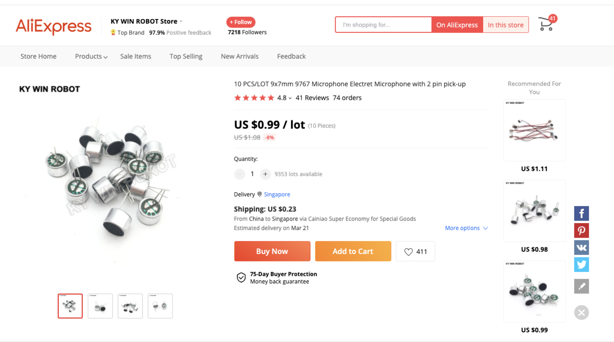</p>
<p align="center"><em>Electret Microphones</em></p>

The items used to waterproof the mic are listed below:

1. Chair bush: To be used as the backing for the mics. Choose a size that fits the electret microphone tightly. These are usually available in local hardware stores.
2. Cling wrap: For waterproofing the front of the electret microphone. The thinner the better.
3. Glue gun with glue stick: Used for waterproofing.
4. 3.5mm mono audio jack: Connector for the sound card. If unable to find a mono jack, we can use a standard stereo jack as well. Either use only the left channel or short both the channels. Both schemes work.
5. Wires: To connect the mic to the sound card.

<p align="center"></p>
<p align="center"><em>Components for waterproofing</em></p>

### Waterproofing

One of the terminals of the electret microphone is connected to the case and is the ground terminal. Connect that to the audio jack ground. The other terminal is output and is connected to the other two (or one in case of mono) connectors of the audio jack.

<p align="center">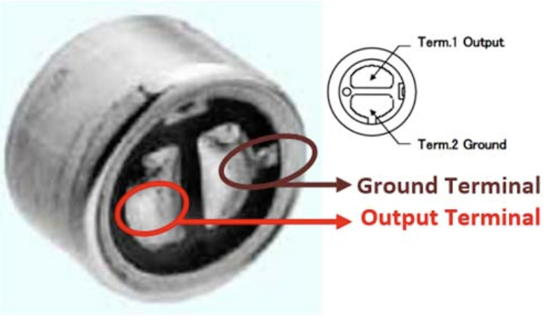</p>
<p align="center"><em>Mic pinout</em></p>

<p align="center"></p>
<p align="center"><em>Connection diagram</em></p>


To waterproof the microphone, use a chair bush of size that fits tightly around it. Make a hole in the closed part of the bush just large enough for the wire. Put the wire through the hole and then pour a sufficient quantity of hot glue to create a good seal and push in the microphone. The microphone should be pushed in in a way that it protrudes out a bit, just enough for the black diaphragm at the front to protrude out a bit from the bush. Let the hot glue dry.

Next, wrap some cling wrap to waterproof the front portion. You can pour some hot glue on the outside surface of the bush and then wrap the cling wrap over the front of the microphone making sure that there is no gap between the cling wrap and the black diaphragm. If there is an air gap, then the performance might be affected.

<p align="center">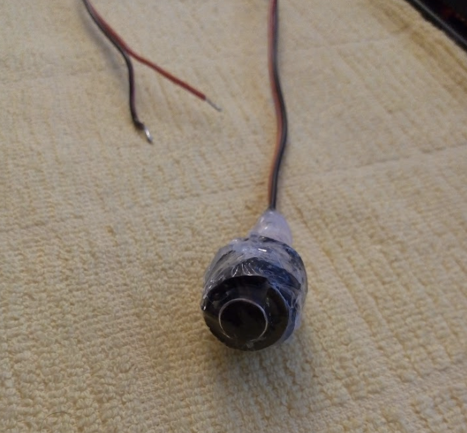</p>
<p align="center">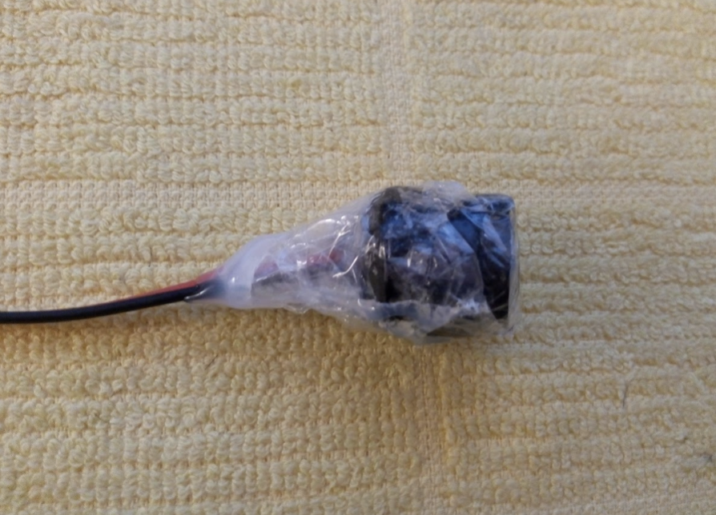</p>
<p align="center"><em>Waterproofed mic</em></p>


### Bill of materials

| Item                                    | Qty  | Cost (USD) |
| --------------------------------------- | ---- | ---------- |
| Raspberry Pi                            | 1    | 129.00     |
| USB sound card for RPi                  | 1    | 0.87       |
| Power amplifier                         | 1    | 0.45       |
| Underwater speaker                      | 1    | 95.50      |
| Electret microphone                     | 1    | 0.99       |
| 3.5mm audio jack                        | 2    | 1.36       |
| Bush, glue gun, glue stick, cling wrap, | 1    | < 20       |
| __Total__                               |      | 292.72     |

> NOTE: It is recommended to get more than 1 for the electret microphone, audio jacks, etc. in case of damage during assembly

## Software installation

### Requirements

- Raspberry Pi 3+
- USB Sound Card
- Headphones/Loudspeaker
- Microphone

### Setup

#### OS 

1. Install the latest [Raspbian](https://www.raspberrypi.org/software/operating-systems/) on your Raspberry Pi

#### Audio

1. Plug the USB audio card into your Raspberry Pi
2. Power on your Raspberry Pi
3. Ensure that the USB Audio Card is detected using `aplay -l`

```
> aplay -l
card 0: ...
card 1: Audio [USB Audio], device 0: USB Audio [USB Audio]
  Subdevices: 0/1
  Subdevice #0: subdevice #0
```
4. Disable the RaspberyPi onboard sound card, by commenting out the line `dtparam=audio=on` in `/boot/config.txt`

```
> sudo nano /boot/config.txt

# Enable audio (loads snd_bcm2835)
# dtparam=audio=on
```

5. Make the USB Audio card the default device in alsa by updating `defaults.ctl.card` and `defaults.pcm.card` to `1` in `/usr/share/alsa/alsa.conf`

```
defaults.ctl.card 1
defaults.pcm.card 1
```

6. Reboot your Raspberry Pi and verify that `card 0:` is not enumerated by `aplay -l`

```
> aplay -l
card 1: Audio [USB Audio], device 0: USB Audio [USB Audio]
  Subdevices: 0/1
  Subdevice #0: subdevice #0
```

7. You can test if your audio setup works properly using  `speaker-test -c2`

### Dependencies

1. Install Java8

```sh
wget https://github.com/AdoptOpenJDK/openjdk8-binaries/releases/download/jdk8u265-b01/OpenJDK8U-jdk_arm_linux_hotspot_8u265b01.tar.gz
tar xzf OpenJDK8U-jdk_arm_linux_hotspot_8u265b01.tar.gz
rm jdk8u265-b01/src.zip
sudo mkdir -p /usr/lib/jvm/java-8-openjdk-armhf
mv jdk8u265*/* /usr/lib/jvm/java-8-openjdk-armhf/
rm -r jdk8u265*
rm OpenJDK8U-jdk_arm_linux_hotspot_8u265b01.tar.gz
echo "export JAVA_HOME=/usr/lib/jvm/java-8-openjdk-armhf" >> $HOME/.bashrc
echo "export PATH=\$PATH:/usr/lib/jvm/java-8-openjdk-armhf/bin" >> $HOME/.bashrc
```

2. Download [portaudio for Linux](http://files.portaudio.com/download.html)
3. Build and install [Portaudio](http://files.portaudio.com/docs/v19-doxydocs/compile_linux.html)

```sh
sudo apt-get install libasound-dev

...

./configure && make

...

sudo make install

...

sudo ldconfig

```

### Run UnetStack

1. Get the UnetAudio Community distribution for RaspberryPi from [here](https://github.com/org-arl/unet-doc/raw/master/docs/downloads/unet-community-pi-3.1.0.tgz)
2. Copy the `unet-community-3.x.x.tgz` file to the Raspberry Pi
3. Unzip the file `tar -xvzf unet-community-pi-3.x.x.tgz`
4. Go to the `~/unet-3.x.x` directory
5. Run UnetAudio using  `bin/unet -c audio`

This will give you a command shell for the user to interact with Unet audio.

## Taking it for a spin

Once the Raspberry PI is set up as above, connect the various hardware components to form the transmit and receive chains. For our testing, we have one setup for transmission and one for the reception.

<p align="center">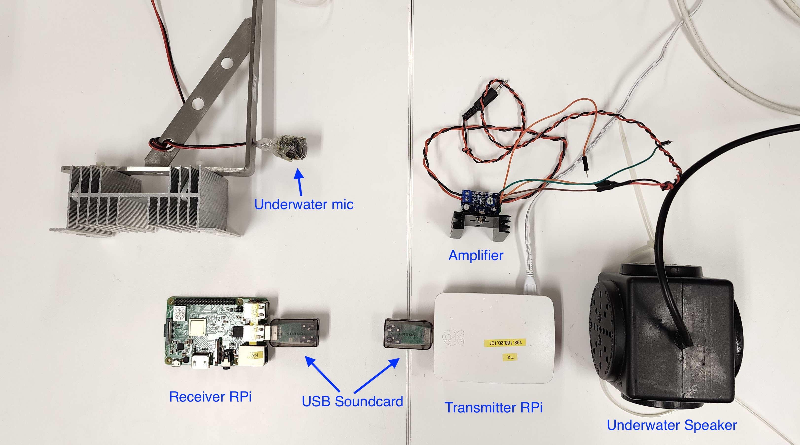</p>
<p align="center"><em>Transmitter and Receiver Components</em></p>

Once we have both setups ready, we need to make sure we are generating the frequencies that the hardware can transmit. If we look at the frequency response of the underwater speaker (provided by the vendor), we can see that the frequency response is from 2 kHz to 8 kHz.

<p align="center">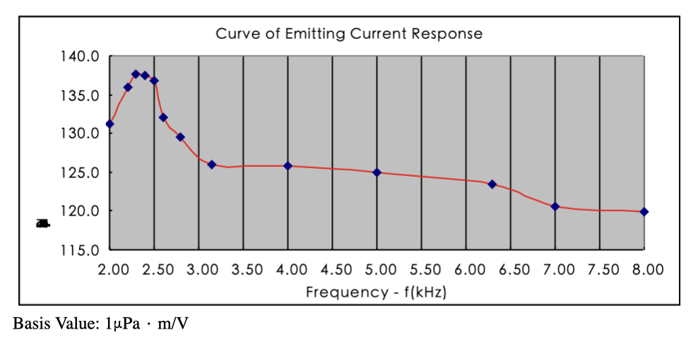</p>
<p align="center"><em>Frequency response of JH001</em></p>


We will need to configure Unet audio to use a frequency band within this space so that the speaker can convert the signals generated by Unet audio to acoustic energy. Unet audio uses frequency hopping [BFSK](https://en.wikipedia.org/wiki/Frequency-shift_keying) as its default communication scheme. The default parameters are as follows:

```
> phy[1]
« PHY »

...

[org.arl.unet.phy.fhbfsk.ModulationParam]
  chiplen = 1
  fmin = 9440
  fstep = 160
  hops = 13
  offset = 0
  sync = true
```

The first tone denoted by `fmin` starts at 9440 Hz, with 13 hops of 160 Hz each. This will be outside the frequency band of our underwater speaker. Hence, we will need to configure it to start after 3.5 kHz and end before 6 kHz. Hence we set the following parameters in the command line.

```
> phy[1].fmin = 4700
4700
> phy[1].fstep = 80
80
```

This will give us a starting frequency of 4700 Hz and a bandwidth of 1040 Hz. Now we are ready to transmit and receive.

Depending on the environment of deployment, the transmit power level can also be adjusted as follows (A value of 0 denotes the maximum power).

```
> plvl -15
OK
```

To get a notification of a reception, use the following command on the receiver side.

```
> subscribe phy
```

Now we can transmit a simple byte stream of `1,2,3` using the following command on the shell.

```
> phy << new TxFrameReq(data:[1,2,3])
AGREE
phy >> TxFrameNtf:INFORM[type:CONTROL txTime:71663975]
```

You will also be able to hear the transmission from the underwater speaker.

Once received and decoded, the following message will be printed in the shell of the receiver side.

```
phy >> RxFrameStartNtf:INFORM[type:DATA rxTime:79709541 rxDuration:3880000 detector:0.27]
phy >> RxFrameNtf:INFORM[type:CONTROL from:1 rxTime:78466374 rssi:-29.8 cfo:0.0 (3 bytes)]
```

The data can be verified by typing the following.

```
> ntf.data
[1, 2, 3]
```

Congratulations, you have successfully made the first transmission and reception using your DIY acoustic modem.
