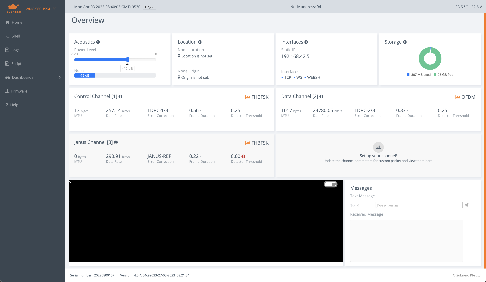
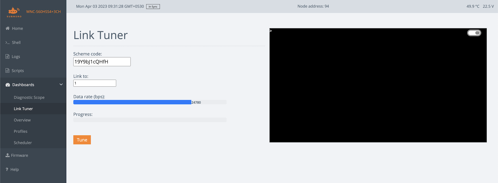
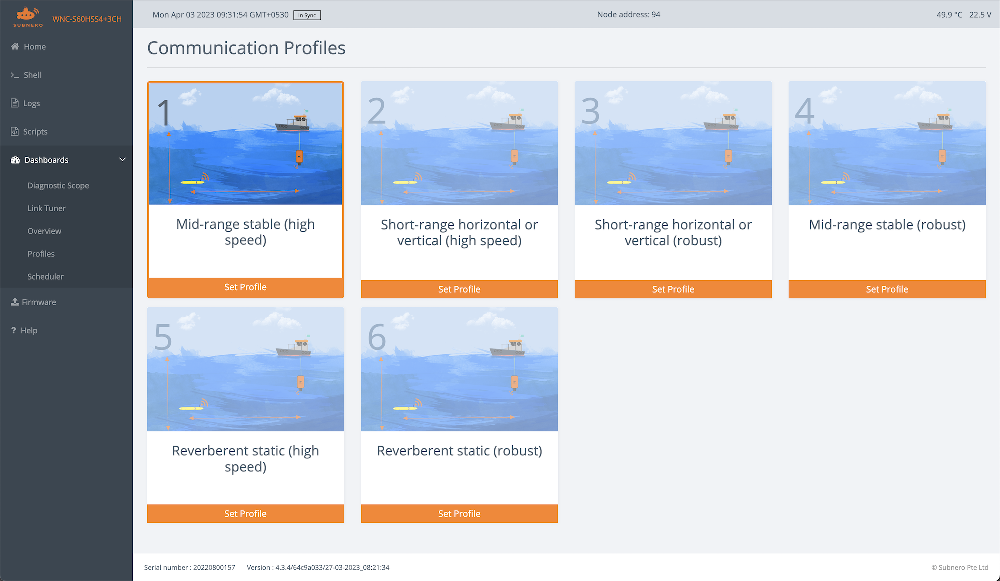

Deploying and configuring an acoustic modem during a field deployment to achieve the best performance can be a challenging task, especially for those who are new to the process. However, with the right tools and techniques provided with UnetStack, it can be accomplished smoothly and efficiently. In this blog, we will provide you with a step-by-step guide on how to deploy and verify a pair of acoustic modems running UnetStack in the field to ensure that it is working correctly and reliably during field deployment. Whether you are setting up a new pair of acoustic modems or troubleshooting an existing one, this guide will provide you with the essential steps to ensure that your wireless system is up and running correctly.

Let's say you are deploying two acoustic modems (modem A and B) in water to establish a communication link between them. For this article, we use the example of a Subnero S60H series acoustic modem. After installing and powering up both modems, you can access the modems' web interface (over the Ethernet interface) by connecting to their respective IP addresses using a web browser. Once you have logged into the modem's web interface, the landing dashboard shows the current settings along with a web shell.

<p align="center" width="100%">
    
</p>
<p align="center"><em>Landing dashboard of a Subnero S60H series modem</em></p>

Depending on the distance between the devices, the first thing you may want to adjust is the power level setting of the two modems to avoid saturating the receiving modem. There is a slider in the landing page that you can use for this (default value set to -42) or you can use the `plvl` command in the web shell.

>  NOTE: We recommend using the following power levels (`plvl`) as the starting values for different distances - 42 to -20 for distances under 10 meters or in air, -20 to -10 for distances between 10 and 100 meters, and -10 and above for distances over 100 meters.

## The `ping` & `tell` commands

Once the power levels are set, the next thing is to test the basic connectivity between the modems, before tuning them to achieve the best performance. First, note the node address of both the modems which we will be using to address each of them. In this example, modem A has a node address of 100, and modem B's address is 120.

Now, we can test the connectivity between both modems using the `ping` command. You can type the following in the web shell of modem A:

```
> ping 120
PING 120
Response from 120: seq=0 rthops=2 time=13974 ms
Response from 120: seq=1 rthops=2 time=12246 ms
Response from 120: seq=2 rthops=2 time=12478 ms
3 packets transmitted, 3 packets received, 0% packet loss
```

This shows that modem A was able to ping modem B and get the response back. It has transmitted 3 ping packets and got a response for all of them.

The `ping` command uses the `CONTROL` channel, which is the robust communication channel provided by UnetStack, typically used to exchange control information between the modems. 

> The `CONTROL` channel is meant for low-rate robust data transmission, whereas the `DATA` channel is typically configured for higher-rate data transmission. You can read more about these in the [unet handbook](https://unetstack.net/handbook).

However, most of the actual payload transmissions are done using the `DATA` channel. So, our next step is to verify that the `DATA` channel works fine between the modems. This can be achieved using the `tell` command. Type the following command in the web shell of modem A.

```
> tell 120, 'hi!'
AGREE
```
On successful reception on modem B, you will see the following:

```
[100]: hi!
```

You can repeat the same from modem B to modem A or use the "Messages" section in the lower right corner of the Overview dashboard. The `tell` command uses a combination of `CONTROL` and `DATA` channels to transfer the payload.

>  You can find more about the `tell` command in section `2.6. Using acoustic modems` in the [unet handbook](https://unetstack.net/handbook/unet-handbook.html).

## File transfer using `fput`

Now that we have a working link, you can transfer data or files between the modems. To transmit data, the [UnetSocket APIs](https://unetstack.net/handbook/unet-handbook_unetsocket_api.html) are a good starting point. These are supported in a variety of languages and levels.

To transmit a file, we can use the `fput` command. First, you will need to enable the [remote agent](https://unetstack.net/handbook/unet-handbook_remote_access.html) in the receiving modem. On modem B, type the following:

```
> remote.enable = true
true
```

Then, use the `fput` command in modem A to transfer the file `abc.txt`:

```
> fput 120, 'abc.txt'
AGREE
```

Upon completion of the file transfer, you will receive a notification once the transfer is complete on the receiving modem.
```
remote >> RemoteFileNtf:INFORM[from:100 filename:abc.txt (4 bytes)]
```

## Speedtest

Once you establish connectivity, you are ready to test the performance of the link. This can be achieved using the `speedtest` agent.

Typing `speedtest` on the shell shows the following:

```
> speedtest
« SpeedTest »

[org.arl.unet.utils.SpeedTest.Param]
  dutyCycle = 0.5
  nowDuration = 10
  nowput ⤇ 0
  rx ⤇ 0
  throughput ⤇ 0
  tx = 0
```

To run a speedtest between the modems, simply type the following on modem A:

```
> speedtest.tx=100
100
```

This will run the speedtest with 100 packets with the peer modem.

> NOTE: The value calculated by the speedtest agent is the effective throughput seen by the user which includes the delays between each packet transmission and any lost packets. E.g. if you have a perfect link with no packet loss, the effective throughput will be half of the link rate due to the default value of 0.5 for the `dutyCycle`.

Once the test is completed, you can check the throughput using the `throughput` parameter.

```
> speedtest.throughput
12390
```

The maximum value of throughput you can achieve is the per-packet signaling rate or link rate that is configured for the device. This can be verified by using the following command:

```
> uwlink.dataRate
24780.055
```

> For more details on each of the parameters, you can use the help text by typing `help speedtest`. 

## Tuning the link

Now that you have a working communication link, we want to tune the link to achieve the best performance. There are three ways to do this.

1. Link Tuner: A link tuner agent will make the required measurements and recommend the setting to achieve the best performance for a given link.
2. Communication Profiles: A set of preset configurations called communication profiles that the user can select from, depending on the environment.
3. Manual tuning: Users have complete control over each of the parameters for a communication scheme that they can modify to achieve the best performance for a given environment. However, this will require an understanding of what each of the parameters means and how they affect communication performance. Hence, this is recommended only for advanced users.

### Link Tuner

The Link Tuner agent automatically makes channel measurements and provides the user with a recommended setting that works best in a given environment. To use the Link Tuner, navigate to the Link Tuner dashboard from the side menu. It shows the current scheme code which is a hexadecimal representation of all the current settings and the current link rate. Click the `Tune` button to begin the process. Once it is completed, a new scheme code is recommended that will provide the best performance in a given environment.

<p align="center" width="100%">
    
</p>
<p align="center"><em>Link Tuner dashboard</em></p>

### Communication Profiles

A communication profile is a set of preconfigured settings that are appropriate for different types of environments. To set a communication profile, navigate to the `Dashboards` menu and select the `Profiles` link. That will give you the following screen with the supported profiles on your device. You can select one that closely matches the environment that you are working on. Once your chosen profile is set, you can verify that the link speed is updated by using the `uwlink.dataRate` command. Run the speed test again to verify the effective throughput you can achieve using the new settings.

<p align="center" width="100%">
    
</p>
<p align="center"><em>Communication Profiles dashboard</em></p>


## Basic Troubleshooting

### 1. The landing dashboard is not loading
1. Check the connection to the modem by pinging the modem's IP address from your laptop.
2. Make sure the modems are powered and the current drawn shown in the power supply corresponds to the published values.

### 2. `ping` is not working
1. Try adjusting the power levels of both modems.
2. Try adjusting the deployment depth of the modem as deploying very close to the surface may create challenging environments.
3. Check the logs (from the logs menu) to see if there are any error messages.

### 3. `tell` is not working (`ping` is working)
This indicates that the `CONTROL` channel is working and the `DATA channel` is having issues.
1. You can start with the Link Tuner or use a profile that is configured for a robust link.
2. Try adjusting the power levels.

In general, you can use `logs` or unsolicited notification messages to understand what is going on. This can be achieved by using the `subscribe` command. E.g. you can subscribe to physical layer events  by:

```
> subscribe phy
```

This will print the various notifications generated by the agent that can be used for troubleshooting. E.g. when receiving packets, the following notifications will be printed in the shell while the `ping` command is used.

```
phy >> RxFrameStartNtf:INFORM[type:CONTROL rxTime:1765508396]
phy >> RxFrameNtf:INFORM[type:CONTROL from:100 rxTime:1765508396]
```
