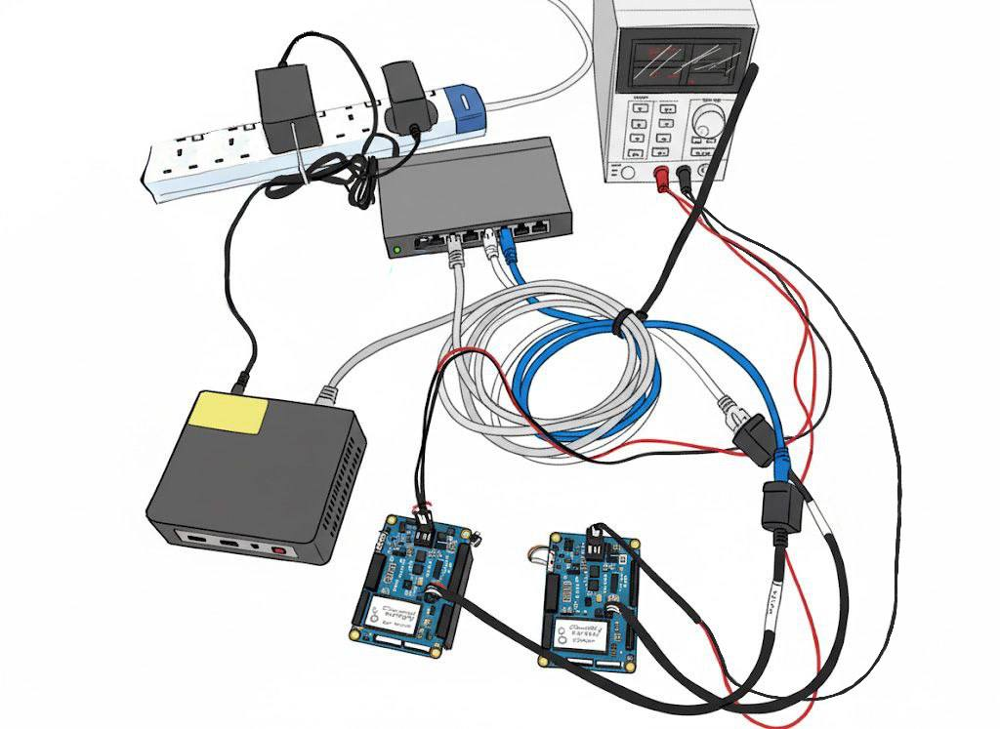

Underwater wireless communication is difficult to design, test, and deploy. The ocean is an unforgiving test environment, with dynamic and often unpredictable propagation characteristics. Access to vessels, dive teams, and favorable weather windows often restrict testing frequency, making rapid iteration nearly impossible.

For researchers, engineers, and system integrators working on underwater networks, simulation is an essential first step. It enables protocol design and debugging, visualizes network behavior, and allows performance evaluation under varying conditions. Most importantly, simulation helps reduce risk before committing to expensive deployments.

## Why Hardware-in-the-Loop (HIL)?

While pure software simulation (where all nodes run on a single computer) is useful, it falls short in certain cases, particularly when real-time behavior, hardware driver integration, and system compatibility are important.

Imagine you are a researcher developing a large scale underwater network. You want to validate not only your algorithms but also the performance of the modems you plan to use in the field. Before investing time and money into an offshore campaign, you want confidence that your system behaves correctly, both in logic and in timing. You also want to try out multiple configurations quickly.

This is where HIL simulations shine. By keeping your real hardware in the loop, you:

- Test the actual modem hardware, drivers, and firmware.
- Verify timing behavior and interface compatibility of your algorithms in the modems.
- Run real world network software with simulated acoustic links.

If your modem is software-defined and open-architecture, such as Subnero's modems, HIL offers a development experience that closely mirrors actual deployment.

## The Foundation: UnetStack v5 + Virtual Acoustic Ocean

Modems running UnetStack v5 — such as those offered by Subnero — are fully software-defined and follow an open architecture. This enables users to customize physical and network layers, extend built-in components, and use the exact same software stack in both simulated and real-world deployments.

[Virtual Acoustic Ocean (VAO)](https://github.com/org-arl/VirtualAcousticOcean.jl) is an open-source acoustic channel simulator. It supports standard propagation models, and allows users to define node positions, protocol stack parameters, and environmental conditions. Simulations can be run in interactive mode, making VAO suitable for everything from basic tests to complex protocol validation.

With a modem running UnetStack v5 and VAO, users are now able to unlock scalable, reproducible HIL simulations that can closely mirror real-world underwater communication scenarios while enabling rapid, repeatable testing without going to sea.

## Typical Use Cases

This simulation setup supports a variety of scenarios. Researchers can use it to develop and validate new communication algorithms such as those at the physical or network layers, under realistic acoustic conditions. Commercial teams can evaluate performance for AUV-based data harvesting or remote sensing missions before heading to the field. Defense teams can rehearse complex mission scenarios virtually, especially in environments where access or testing is restricted.

## Step-by-Step Guide to HIL Simulation

Before beginning the simulation, ensure you have the following setup:

- Two Subnero M25M series modems running UnetStack v5.
- A laptop or mini-PC with Julia installed, capable of running the Virtual Acoustic Ocean (VAO) simulator.
- An Ethernet switch to connect all devices to the same network.

<figure> </figure>

All components — modems and the VAO-running machine — should be on the same subnet to be able to reach each other using their IP address.

> **TIP:** Use an isolated network switch (without internet access) to avoid interference from unrelated network traffic during simulation.

> Note: This example uses Subnero M25M (MF-band) modems, but the same steps apply to Subnero's LF and HF modems. The simulation script provided is just one example — please refer to the VAO GitHub repository for the latest examples, which may differ. This guide shows how to connect two Subnero modems, but more nodes can be added by extending the script with additional addnode! lines.

---

### 1. Install VAO and Packages

At a Julia terminal:

```julia
using Pkg
Pkg.add(name = "VirtualAcousticOcean", version = "0.8")
Pkg.add("UnderwaterAcoustics")
Pkg.add("Sockets")
```

---

### 2. Add Example Scenario

Copy the `2-node-network.jl` file from the [GitHub repo](https://github.com/org-arl/VirtualAcousticOcean.jl) examples folder to your working directory.

**Example content:**

```julia
using VirtualAcousticOcean
using UnderwaterAcoustics
using Sockets

env = UnderwaterEnvironment(seabed=SandyClay, bathymetry=40.0)
pm = PekerisRayTracer(env)
sim = Simulation(pm, 24000.0)
addnode!(sim, (0.0, 0.0, -10.0), UASP2, 9809, ip"0.0.0.0")
addnode!(sim, (1000.0, 0.0, -10.0), UASP2, 9819, ip"0.0.0.0")
run(sim)

println("Simulation running with these nodes:")
for (idx, node) in enumerate(sim.nodes)
    println("  - Node $(idx) at position $(node.pos) receiving on UDP port $(node.conn.port)")
end

wait()
```

> Note: The example shown here is representative. The version available in the [VAO GitHub repository](https://github.com/org-arl/VirtualAcousticOcean.jl) may differ slightly depending on updates or version changes.
**Run it from the terminal:**

```bash
> julia --threads auto 2-node-network.jl
Simulation running with these nodes:
  - Node 1 at position (0.0, 0.0, -10.0) receiving on UDP port 9809
  - Node 2 at position (1000.0, 0.0, -10.0) receiving on UDP port 9819
```

---

### 3. Configure Subnero Modems

Each modem needs to be configured to redirect its baseband interface to VAO. Access each modem’s web UI and upload this `modem.toml` to the Scripts folder:

```toml
[input]
analoginterface = "UASP2DAQ"
ip = "192.168.42.10"
port = 9809

[output]
analoginterface = "UASP2DAQ"
```

> Ensure this matches the VAO machine's IP and each modem uses the correct port (e.g. 9809). Additionally, the `[output]` section is optional and typically used when configuring a physical modem.

**Verify the setup via modem shell:**

```shell
bb
```

**Expected output:**

```
> bb
« Baseband »

Baseband service for UASP2DAQ.AnalogInterface
...
```

Also check modem logs for an entry similar to:

```
1750584190212	INFO	UASP2DAQ@27:UASP2DAQ@1:57	Connecting to UASP2 DAQ at 192.168.42.10:9809...
```

That's it. Now you have 2 nodes deployed 1 km apart and connected through VAO. With the nodes now connected via VAO and properly configured, you can begin interactive testing and messaging between the modems.

---

### 4. Set Transmit Power

Since the modems are deployed 1 km apart, set full transmit power:

```shell
plvl 0
```

---

### 5. Test the Link

Send a test message from either of the modem's shell:

```shell
tell 0, "Hello Sea"
```

You should see the message on the receiving modem’s shell, confirming that the simulated link is working.

---

## UnetCube (UnetStack OEM Edition) + VAO

If you do not have Subnero modems, you can still simulate the system using UnetCube (UnetStack OEM Edition) on single-board computers (e.g., Jetson Orin Nano). The simulation behavior will be the same, enabling rapid prototyping.

<figure> </figure>


Contact [info@subnero.com](mailto:info@subnero.com) for more information.

---

## Additional Resources

- [VAO GitHub Repository](https://github.com/org-arl/VirtualAcousticOcean.jl)  
- [UnetStack](https://unetstack.net)  
- [Subnero](https://subnero.com)
