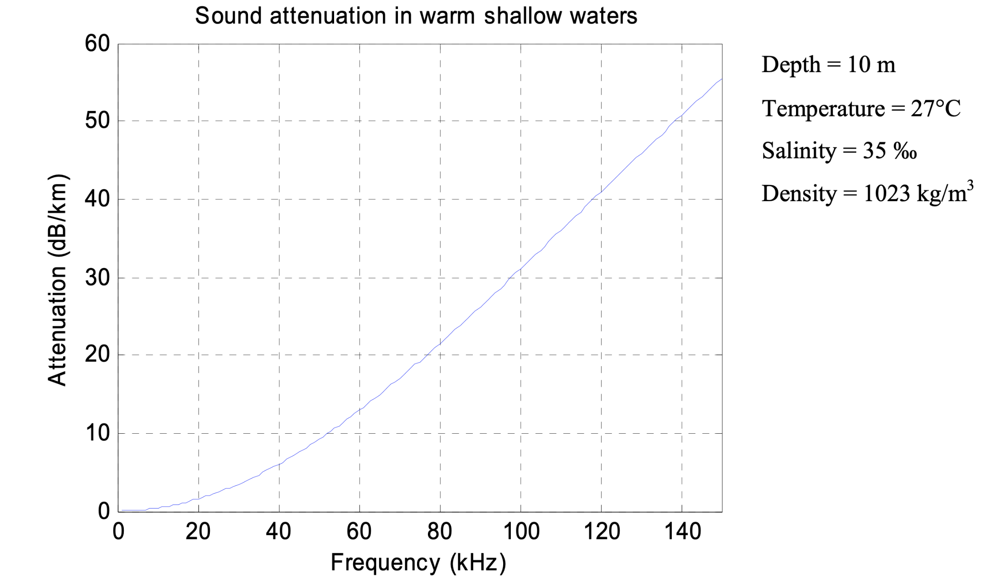
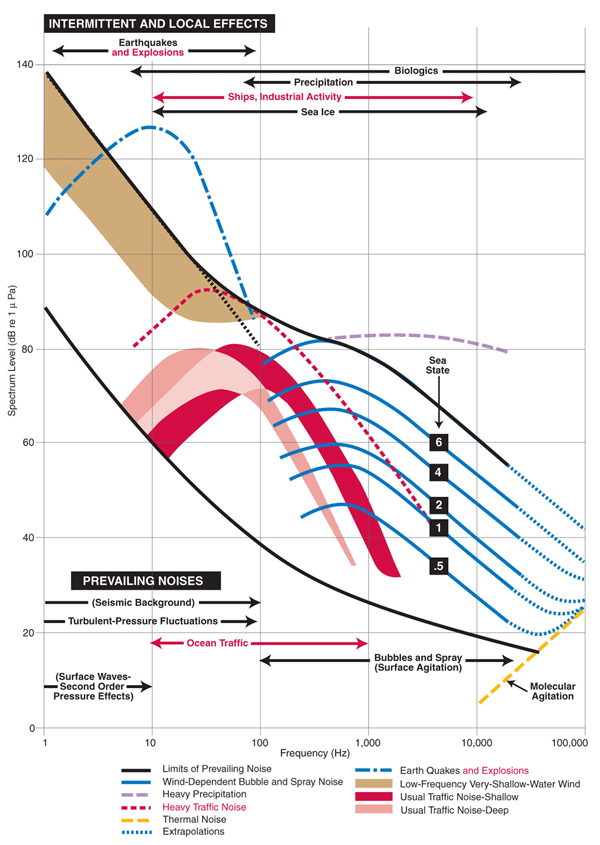

_This two-part article is based on the talk “Connectivity with Confidence: Acoustic Communication and Navigation in Practice,” delivered by Professor Mandar Chitre (National University of Singapore). The blog was written to distill the key ideas from that presentation into a written form for a wider audience._

When we ask a room of subsea robotics developers and users how many have used underwater acoustic communications, we often see a good number of hands. But when we follow up and ask how many feel confident that, when they put a vehicle in the water, the acoustic link will “just work,” the show of hands drops dramatically. That gap is what we want to address in this two-part series. It’s time to move from treating communication as a nice-to-have, something added reluctantly and not relied upon, to building connectivity with confidence.  

For a long time, skepticism about acoustic links was justified. They were fragile, unreliable, and unpredictable. But technology has evolved. With the right choices and a bit of discipline, it is now possible to achieve robust, dependable connectivity that not only supports communication but also navigation. In fact, when we use the word connectivity, we mean both. Acoustics underpins them together. Aerial drones exploded in use partly because of easy communication and GPS navigation. Underwater vehicles, by contrast, have been held back because we lacked the same level of confidence in connectivity. We believe that can change.  

# The Basics

## Why Acoustics?

Radio and most light simply don’t travel well underwater. Even visible light in clear water only gets you tens of meters; in turbid coastal waters like Singapore, it is even less. Acoustics, on the other hand, propagate hundreds of meters, to tens of kilometers. Frames typically contain a preamble, data modulated onto a carrier, error correction, and checksums. Robust incoherent modulation schemes work well for commands and telemetry, while coherent modulation schemes are needed for images and high-rate data. Forward Error Correction (FEC) and erasure codes add robustness without long feedback cycles. This is critical because sound travels so much slower than light.

## Acoustic communication

When we talk about frames and packets underwater, it is useful to be precise. A packet is a unit of data, but modems often fragment it into smaller frames for transmission. Each frame has its own preamble, data, and error check. On the receiving side, fragments are reassembled into the original packet. Because underwater channels lose frames more often, we need mechanisms to deal with the loss. Automatic Repeat Request (ARQ) is one approach: the receiver asks for specific lost fragments to be re-sent. But given the long propagation delays, this can waste valuable time. Erasure correction coding provides another option: by adding some extra parity frames at the start, the receiver can reconstruct the whole packet as long as it collects enough of the transmitted frames, even if a few are missing. This avoids the need to wait for a round-trip of acknowledgements, which can often take long underwater.

Next, there are also some terms that we need to define clearly. Robustness refers to the chance that a packet crosses cleanly the first time, without errors. Reliability, on the other hand, is the end-to-end guarantee that comes from feedback and retransmission if needed. Both are useful, but they come with different costs. Similarly, we care not about raw link rate, which is the number printed in the datasheet, but about throughput or “goodput”: the actual amount of useful data delivered correctly. A link claiming tens of kilobits per second may in practice give you only a fraction of that once protocol overheads and frame loss are accounted for. Understanding these distinctions avoids confusion when comparing modems or planning missions.

## Acoustic navigation

Navigation is built on the same acoustic signals. The simplest method is two-way travel time ranging: one device transmits, the other responds, and the round-trip time divided by two gives you a range. With synchronized clocks, we can also do one-way travel time ranging, which halves the time taken for ranging, and reduces energy usage (but requires very stable oscillators). Using several surface nodes with GPS, we can build long-baseline (LBL) systems, where either the topside knows the vehicle’s location or the vehicle computes it itself in “inverse LBL.” With a single beacon, compact Ultra-Short Baseline (USBL) systems estimate bearing and range together, and again, they can be configured in normal or inverse modes depending on where you want the computation to happen. These methods are mature and well-proven in underwater systems, but they still face practical challenges in real deployments—from multipath and synchronization drift to environmental variability—so it’s important to account for these factors early in your system design.

# Why doesn't it “just work”?

Many people are surprised when an underwater modem doesn’t “just work.” The reason is that the ocean is an entirely different medium from the air or fiber networks we are used to. Bandwidth is scarce, signals bounce off the surface and seabed creating echoes, vehicle motion causes Doppler, and noise from ships or even snapping shrimp can overwhelm weak signals. On top of this, sound travels 200,000 times slower than light, so protocols designed for the Internet break down. Unless these realities are accounted for, what looks good on paper quickly fails at sea.

One of the most useful ways we have found to explain the pitfalls is through a simple list of don’ts and do’s. The don’ts are the traps that catch many first-time users—but each of them has a simple alternative. Don’t assume you can simply replace a tether with modems and expect the same reliability; acoustic networks require new ways of thinking about timing and robustness. Don’t use internet protocols blindly, because the assumptions of fast feedback and low loss don’t hold underwater; purpose-built protocols handle this far better. Don’t ignore the physics of bandwidth, absorption, and Doppler; knowing these limits helps you plan within what the ocean can actually support. Don’t overload the channel by pushing it to its theoretical maximum; leave headroom for retries and environmental fluctuations. Don’t reinvent decades of work already built into frameworks like UnetStack; start with proven foundations and tune from there. And finally, don’t try to optimize everything before you have a stable link—get it working robustly first, then improve it. We’ll come back to how each of these “do’s” map into the five levels of confidence that follow.

These are practical steps starting from the technology choices you make, through integration and planning, and extending into advanced adaptive techniques that, if followed, can transform underwater communication from a gamble into something you can rely on.

# The five levels of confidence

These five levels capture the progression from basic design decisions to advanced adaptive techniques that push performance further. The first three are essential; the last two are advanced. In this first part, we’ll cover the first three.

## Level 1: Technology choices

Before you even build or buy, the technology choices you make set the upper bound for what your system can achieve. The first and most important is the frequency band. Higher frequencies in the hundreds of kiloHertz give you short-range but high-rate links, suitable for a few hundred meters and applications like image or file transfer. Mid-range frequencies in the tens of kiloHertz are the workhorse for kilometre-scale missions. At the other end, only a few kiloHertz will carry over tens of kilometres, but at the cost of data rate. Every choice is a trade-off between absorption, ambient noise, and usable bandwidth, so you need to pick the sweet spot that matches your mission profile. As shown in Figure 1, sound attenuation in warm shallow waters increases steeply with frequency. This relationship is what drives the trade-off between range and data rate when selecting an operating band.

<figure> </figure>

Figure 1: Sound attenuation in warm shallow waters

Transmit source levels are another key decision. These are not just about the hardware spec sheet. They are limited by environmental regulations on noise, by cavitation thresholds when operating shallow or with small vehicles, and by whether your power system can actually supply the transient peaks that the transducer draws. Directivity is equally important. Omnidirectional transducers are simple to deploy, but if you know the geometry of your mission, directional transducers can make the most of your energy. On the receiver side, adding spatial diversity is often an overlooked but powerful option. Just as Wi-Fi access points benefit from multiple antennas, a small array of hydrophones can significantly improve robustness, and it is usually inexpensive to add on a surface platform or larger vehicle.
Finally, consider modulation and coding. It is tempting to chase the highest bit rates, but robustness almost always matters more. Choose the lowest rate that still meets your data needs, and use forward error correction or erasure coding to carry you through challenging conditions. Navigation is also part of the early design stage. Decide whether you will rely on simple two-way ranging, or if your system can support synchronized clocks for one-way measurements. Think about whether your setup favours long baseline (LBL), inverted LBL, Ultra-Short Baseline (USBL), or inverted USBL. These are not afterthoughts, they fundamentally shape what your system can deliver once it is in the water.

<figure> </figure>

Figure 2:  _The typical sound levels of ocean background noises at different frequencies, as measured by Wenz (1962). This graph is therefore also referred to as the Wenz curves. The sound levels are given in underwater dB summed over 1 Hz wide frequency bands, which is often written as dB re 1 µPa2/Hz. [Adapted (after National Research Council, 2003) from Wenz, G. M. (1962). Acoustic ambient noise in the ocean: Spectra and sources. The Journal of the Acoustical Society of America, 34(12), 1936–1956.](https://dosits.org/science/sounds-in-the-sea/what-are-common-underwater-sounds/)_

Beyond frequency, power, and modulation, there are also important choices in how multiple users share the channel and how higher-level data is handled. Medium access control (MAC) is a prime example: if you can synchronize your devices, a time-division scheme (TDMA) often provides the most predictable performance; if traffic is bursty or unpredictable, random-access approaches like CSMA or MACA may be better, though they come with higher overhead. At higher layers, think about how your system expresses priorities and deadlines. Some data is time-sensitive (like vehicle position), while other data may be large but delay-tolerant. A modem or stack that allows you to configure quality of service, set time-to-live values, and even declare content types (e.g. image, telemetry, audio) can make smarter transmission decisions on your behalf. The overall configurability of the technology is therefore not just a “nice-to-have”, it is a core part of making sure the link adapts to your mission requirements instead of forcing your mission to adapt to the link.

And if navigation is part of your mission, you also need to decide upfront whether the system should support ranging and localization, whether it can provide synchronized time across nodes, and how stable the clocks are in practice. These capabilities determine not just how you communicate, but how you localize vehicles underwater, so they must be considered at the same stage as frequency bands and modulation schemes.

## Level 2: Integration hygiene

When it comes to mechanical integration, factors such as the placement of the transducer plays an important role. Simply mounting it wherever there is space on a vehicle rarely works well. Thrusters generate noise and, more critically, microbubbles that persist in the water and scatter sound, destroying coherent links even when SNR looks good. Flow noise from fast-moving vehicles, vibrations from mechanical structures, and even the rigidity of the mounting bracket all contribute to degraded performance. We have seen vehicles that lost their link whenever they moved away from the ship, only to recover it as soon as they turned slightly, simply because their thruster wake sat directly in the acoustic path. The wake was filled with microbubbles that scattered and distorted the sound waves, severely degrading the signal even though the signal-to-noise ratio appeared good. Paying attention to transducer location and characterizing flow and thruster noise early in the integration process prevents many of these headaches. Ambient noise in the operating environment can also vary dramatically, shipping lanes, construction sites, and even biological sources like snapping shrimp can raise the noise floor and reduce performance. On top of this, interference from other acoustic systems, whether they are echo sounders, sonars, or other modems, can overlap with your own signals if frequencies are not coordinated. Factoring these acoustic neighbours into integration and deployment decisions is critical.

Electrical integration is just as critical. Modems draw sharp bursts of current during transmission, and if the power bus is noisy or poorly filtered, that noise couples back into the receiver front end. Clean power supplies and proper filtering are essential to ensure consistent source levels and avoid self-interference. Once integrated, it is important to measure actual source levels in situ, because cabling, mounts, or limited current draw from a vehicle’s battery system may reduce output below specification. Shallow-water operation at high source levels can also cause cavitation, producing bubbles that not only damage transducers but also severely degrade signals. Regularly checking for cavitation thresholds and logging ambient noise levels in your deployment area helps ensure that electrical and acoustic integration issues do not compromise the system. Beyond hardware, it is equally important to evaluate communication performance after integration: measure diagnostics such as packet delivery ratios, latency, and ranging accuracy in realistic conditions. These checks often reveal integration flaws that would otherwise remain hidden until deployment. Synchronization and ranging performance must also be verified, since even small timing errors can undermine both communication and navigation functions if not properly accounted for.

Software integration is the third pillar of hygiene. Too often, teams treat the modem as a transparent pipe and push raw bytes across. This wastes much of what modern stacks can offer. In UnetStack, for example, applications can attach metadata such as robustness level, reliability, time-to-live, priority, and MIME type to each message, allowing the modem to make smarter delivery decisions. A short snippet shows how this works:

Example AUV code snippet:

```groovy
sock = UnetSocket('192.168.0.42', 1100)
sock.connect(sock.host('TOPSIDE'), 32)
sock.ttl = sock.TTL_MAILBOX
sock.mailbox = 'STATUS'
sock.mimeType = 'application/json+auvstatus'    // facilitate application-specific compression
while (true) {
  status = c2.getStatus()
  sock.send(status.toJson().bytes)
  sleep(1000)
}
```

Example TOPSIDE code snippet:
```groovy
sock = UnetSocket('192.168.0.27', 1100)
sock.bind(32)
while (true) {
  rx = sock.receive()
  ui.showStatus(json.parse(rx.data))
}
```

By tagging data this way, we give the modem the context it needs to adapt to current conditions, compressing an image if bandwidth is poor, discarding stale telemetry instead of wasting airtime, or prioritizing urgent commands. This transforms software integration from a simple “pipe” to a smarter, adaptive communication framework that supports confident operation in real-world deployments.

## Level 3: Deployment planning

Deployment planning is where theory meets the ocean, and it makes a huge difference to communication performance. Many users ask a simple question: what range will I get with this modem? Unfortunately, the answer is never a single number. Communication performance depends on much more than just distance. It is shaped by depth, bottom type, water column properties, and geometry. Acoustic energy refracts, reflects, and cancels in ways that create “hot spots” and “dark zones.” A link that looks strong at 500 meters might vanish entirely at 800 meters, only to return at 1,200 meters. Planning missions without considering this variability often leads to surprises in the field.

One of the most effective ways to plan is through propagation modeling. Physics-based models, if you have good knowledge of the environment (sound speed profile, seabed composition, depth, and bathymetry), can predict where signals will carry well and where they will fail. Even with limited data, these tools can produce maps of expected signal-to-noise ratio that guide decisions such as when to run telemetry updates or attempt bulk transfers. If modeling or measurements are not possible, rules of thumb can still be applied to avoid known traps, like the Lloyd mirror effect.

The Lloyd mirror is a particularly important phenomenon to account for. Near the surface, acoustic signals arrive via both a direct path and a surface-reflected path. The reflection undergoes a 180° phase shift, so when the two signals overlap, they can cancel each other out and create a dark band of poor reception. This effect shows up consistently in field tests and models alike. The solution is simple: increase the combined depth of the transmitter and receiver. That could mean mounting the transducer deeper on a vehicle, or placing the surface modem further below the waterline. Small changes in depth can move the system out of destructive interference zones and into regions of strong signal, dramatically improving reliability. Planning missions with this in mind, whether through detailed modeling, in-situ measurements, or rules of thumb, turns deployment from guesswork into an informed exercise.

Do these three levels well, and you are already far ahead. You will have a link you trust for commands and telemetry, predictable windows for heavier data, and navigation updates at the cadence you need. In part 2, we’ll explore levels four and five, adaptive links and adaptive missions, where the system and the vehicle adjust in real time.
