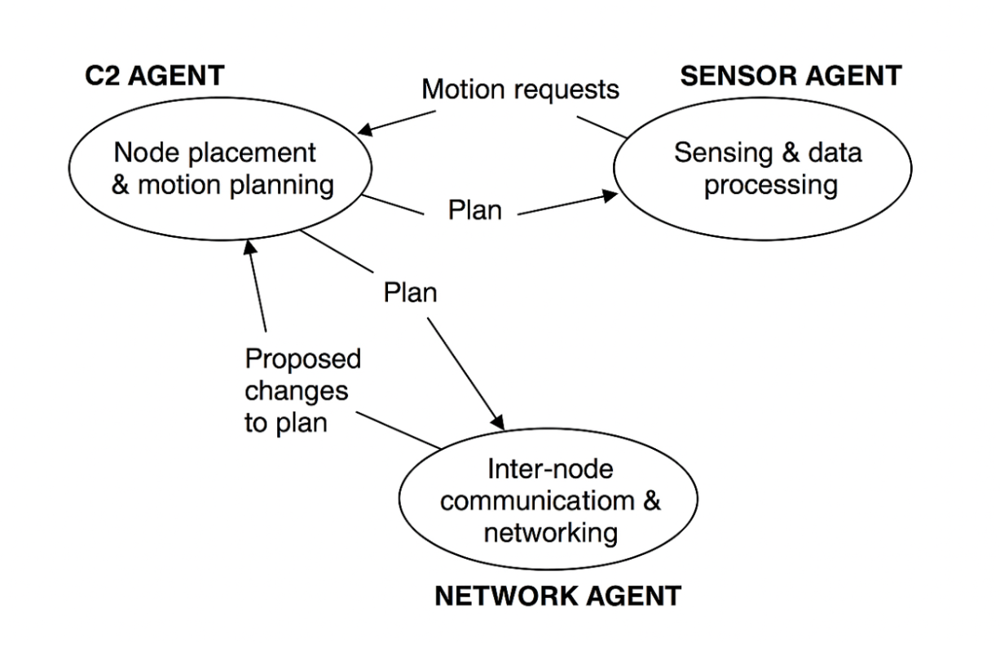
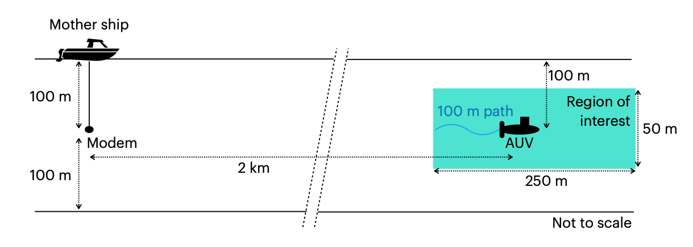
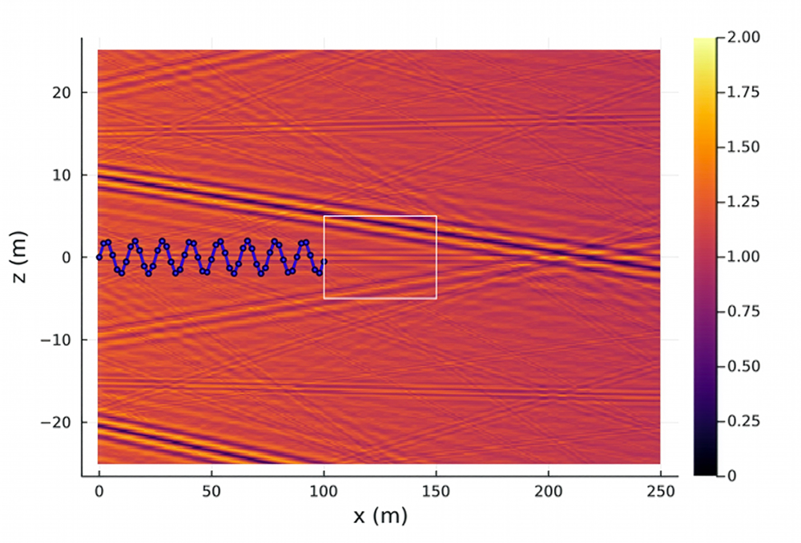
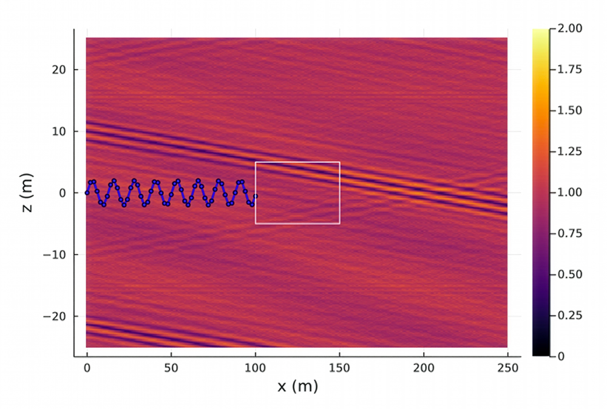

In part 1, we discussed the first three levels, technology choices, integration hygiene, and deployment planning. Those alone get you most of the way to confident connectivity. In this post, we’ll describe the last two levels, where systems adapt in real time and missions flex slightly to help communication.  

## Level 4: Adaptive communication links

Once a vehicle is in the water, the ocean reveals its true character. Conditions change with depth, movement, and even the passing of ships. Instead of locking parameters before deployment, we can let the modem adapt in real time. Adaptive modulation schemes allow the system to step down to more robust modes when multipath or Doppler is high, and step up again when the channel clears to deliver higher throughput. Similarly, error control coding can be tuned dynamically: adding more redundancy when losses rise, and trimming it back to recover data rate when the link is clean. Erasure codes are particularly useful underwater; they let us transmit a little extra upfront, so the receiver can reconstruct the message even if several frames are lost, without the delay of waiting for acknowledgements. Together, these adaptive techniques turn a static link into one that bends with the ocean instead of breaking against it.

Adaptivity is not only about modulation; it’s also about choosing the right link at the right time. Most vehicles today carry more than one communication interface, Wi-Fi or 4G when surfaced, satellite on a mothership or shore station, optics for short range underwater, and acoustics for longer ranges. A smart stack can switch among these automatically, routing different types of data to the most suitable link. For instance, video streams can go over Wi-Fi when the vehicle is near the surface, low-rate telemetry can flow over acoustics while submerged, and large files can transfer over optical when in close range. By declaring the content type, time-to-live, and priority of each data stream, operators can leave the decision-making to the stack instead of micromanaging links. UnetStack, for example, allows this kind of policy-based routing, so vehicles can focus on their mission while the communication system quietly optimizes delivery.

All of these adaptive behaviours—whether changing modulation and coding in real time, dynamically routing across multiple links, or delivering content based on link availability—are already supported in UnetStack. In this article, we’ve focused on the why and what of adaptive communication, but in future blogs, we’ll dive into the how: demonstrating how these ideas are implemented in UnetStack.

## Level 5: Adaptive command and control

The highest level of confidence comes when vehicles themselves adapt their missions based on feedback from the communication system. Instead of treating comms as an independent subsystem, we can use information about link quality to make small but meaningful changes in behaviour. For example, if the modem detects that the channel is degrading, the vehicle might pause bulk transfers, climb or dive a few metres to escape a dead zone, or slightly adjust its course to maintain better connectivity. These interactions are illustrated in Figure 1, which shows how different onboard agents—command and control (C2), network, and sensing—communicate with each other to adjust plans dynamically. By keeping this feedback loop lightweight and local, vehicles can preserve their mission goals while still giving the communication system a chance to perform optimally. This idea of adaptive mission execution moves connectivity from being a fragile dependency to becoming an active part of mission planning.

<figure> </figure>

Figure 1: Schematic of adaptive mission execution. The C2 agent manages node placement and motion planning, the sensor agent handles data acquisition and processing, and the network agent oversees inter-node communication. Feedback from the network agent informs the C2 agent about link quality, prompting small plan adjustments that keep missions robust without human intervention. From M. Chitre, “A holistic approach to underwater sensor network design,” in Proceedings of Naval Technology Seminar (NTS) 2011, May 2011. (Invited).

Recent work ([_M. Chitre and K. Li, “Physics-informed Data-driven Communication Performance Prediction for Underwater Vehicles,” in The 6th Underwater Communications Networking (UComms 2022), (Lerici, Italy), 2022._](https://arl.nus.edu.sg/wp-content/uploads/2022/09/Chitre_Physics-informed_UComms-2022.pdf)) has shown that we can go even further by predicting what lies ahead using lightweight, physics-informed, data-driven models. The idea is simple but powerful: as an autonomous vehicle moves, it measures acoustic signal strength along its path and uses those observations to predict what the field will look like in the region just ahead. Rather than relying purely on machine learning, which struggles to extrapolate beyond the data it has seen, this method embeds the underlying physics of acoustic propagation directly into the learning process. Each measurement is treated as a combination of rays arriving from different directions, and a sparse optimization algorithm estimates which ray angles and amplitudes are most likely to explain the observed field. By constraining the learning to the acoustic wave equation, the algorithm can make physically realistic predictions even with very little data.

In the study, a simulated AUV travelled along a 100 m segment at a depth of 100 m, taking signal-strength readings every metre while communicating with a surface ship 2 km away (Figure 2). Using only those 100 measurements as input, the model then predicted the acoustic field across a 250 m × 50 m region in front of the vehicle. The ground-truth field computed with the BELLHOP propagation model is shown in Figure 3, while Figure 4 shows the model’s predictions using the physics-informed approach. The resemblance between the two fields is striking: even fine-scale interference patterns and “dark zones” of low signal strength are reproduced well enough to guide adaptive path-planning. Because the model learns from multiple frequencies simultaneously and enforces sparsity across ray arrivals, it generalizes far better than traditional data-driven methods. In practice, this means a vehicle can predict where the link will hold and where it will fade, and adjust its trajectory before the connection is lost—all in real time and with modest onboard computing resources.

<figure> </figure>

Figure 2: Simulation setup

<figure> </figure>

Figure 3: Ground truth signal strength integrated over the 9–14 kHz band, as obtained from BELLHOP over the region of interest. The AUV path is shown in blue, with solid dots showing the measurement locations. The white rectangle shows a region marked for closer inspection.

<figure> </figure>

Figure 4: Predicted signal strength integrated over the 9– 14 kHz band, over the region of interest. The AUV path is shown in blue, with solid dots showing the measurement locations. The white rectangle shows a region marked for closer inspection

This work demonstrates how data and physics can come together to make underwater communication systems proactive rather than reactive. Instead of waiting for a link to fail and then compensating, vehicles can now anticipate when and where communication will degrade, and adjust before it happens. These predictions close the loop between perception and control—turning what was once a static channel model into a living part of the mission logic. Combined with the adaptive mission behaviours discussed earlier, such models make it possible for underwater vehicles to plan smarter routes, schedule transfers more intelligently, and ultimately operate with a level of confidence that was previously out of reach.

# Putting it all together

When you add adaptation to the first three levels, the operating picture changes. Operators declare intent and monitor goodput, not tweak knobs. Vehicles help themselves with minor depth or timing shifts. Multi-link stacks exploit whatever the environment offers. Most importantly, the link stops being an unreliable afterthought, and starts being trusted.  

The message is simple, physics still sets the limits, but if we respect it, plan for it, and adapt intelligently, those limits work for us. Once we have that confidence, we can design missions and systems that rely on the link instead of avoiding it.  
