Picture this: You are running a mission with a mobile underwater node. You have a multi-receiver acoustic system on your surface vessel ensuring a robust, high-speed communication link. But as the autonomous underwater vehicle (AUV) navigates the mission, you also need to know exactly where it is. What if you didn't need to deploy a completely separate tracking system for this? What if the exact same hardware you are using to talk to your AUV could also be used to track it?

Space, weight, and budget are always at a premium in subsea deployments. If you are using a multi-receiver communication system running UnetStack, it is highly likely that you have access to the raw acoustic data and the timing information from all your receiving channels. Because UnetStack natively supports these multi-receiver architectures, it is possible to use your existing communication hardware for the localization and tracking of targets too.

Take the [Subnero multi-receiver modem](https://subnero.com/products/wnc/gen4x/accessories/multi-receiver.html){:target="_blank"} as a practical example. We are frequently asked if this system can be used as a USBL transceiver. The short answer is yes. While the primary purpose of its multi-receiver architecture is to enhance communication performance through spatial diversity, the hardware requirements for localization are almost identical. Therefore, converting it into an Ultra-Short Baseline (USBL) transceiver is remarkably straightforward.

The resulting setup is basically a modern USBL system approached "from the other side." Most traditional USBL systems available today provide some basic communication capability in addition to their primary tracking functions. Conversely, a UnetStack-powered multi-receiver modem allows you to add tracking capabilities on top of the communication link.

In this blog post, we will demonstrate how two minor modifications, some rigid scaffolding for the modem's hydrophones and a script run on your laptop, are all that stand between you and a fully functional USBL system. Specifically, we will first walk you through the concrete steps required to configure a multi-receiver modem as a transceiver, and then we will peek under the hood to explain in detail how this system works. But before all that, let us begin with a quick refresher on USBL systems.

<div style="width: 100%; display: flex; flex-direction: row; gap: 0.5rem 2rem; justify-content: center; align-items: start; flex-wrap: wrap; font-style: italic; text-align: center;">
<div>
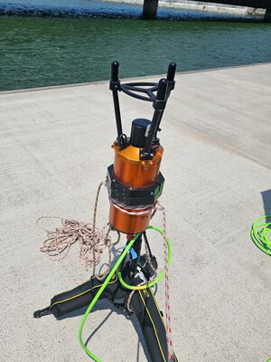
<p>USBL transceiver ready to be lowered onto the seabed.</p>
</div>
<div>
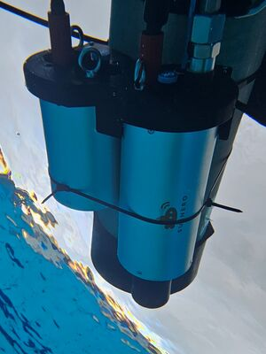
<p>USBL transponder attached to a diver tank.</p>
</div>
</div>

## USBL Basics

The basic working principle of a USBL system is that a transceiver sends out an interrogation signal and then waits for a response from a transponder unit attached to the tracking target. The overall delay between the interrogation and its response then informs the tracker about the range to the target, and the small differences in arrival times across an array of hydrophones on the transceiver allow it to estimate the bearing. Together, these two pieces of information pinpoint a unique target location in three-dimensional space.

<div style="width: 100%; display: flex; flex-direction: row; justify-content: center; align-items: center; gap: 0rem 2rem; flex-wrap: wrap;">
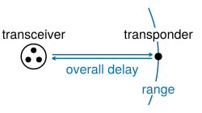
+
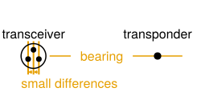
=
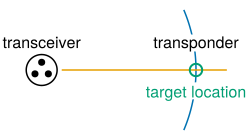
</div>

## Installing the Dependencies

Our goal is now to replicate a USBL system using a pair of UnetStack modems and a few [Julia](https://julialang.org/){:target="_blank"} scripts available from the [`unet-contrib` GitHub repository](https://github.com/org-arl/unet-contrib/blob/master/contrib/usbl){:target="_blank"}. Therefore, as a first step please download the repository and then run the provided `./install` script to install a Julia runtime plus a few Julia packages. Note that your modems must be running UnetStack v5 or later for the following scripts to work.

## Setting Up the Multi-Receiver Modem

To convert arrival times into arrival direction, the USBL modem must know the precise arrangement of its receiving elements. Therefore, its transducer and the three hydrophones must be attached to some rigid structure (e.g. a frame, a boat or an AUV) and then their precise locations must be made available to the USBL software. When attaching the hydrophones, care should be taken not to obstruct the main bulb of the hydrophones, and the overall geometry should be close to tetrahedral with a side length as large as possible but at least 15 cm (6 inches) for a modem with a center frequency of 24kHz.

<div style="text-align: center; font-style: italic;">
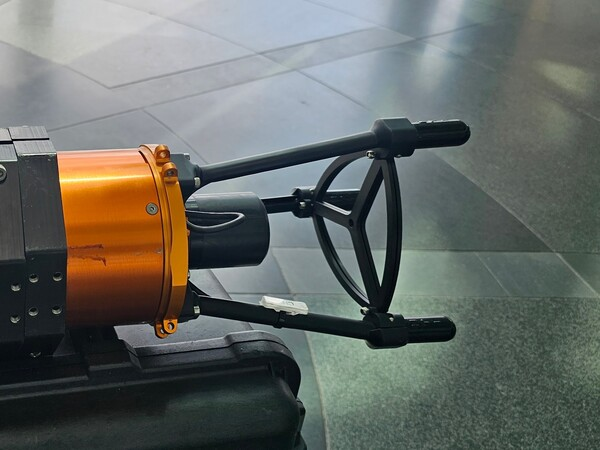
<p>Subnero multi-receiver modem with a 3D-printed frame to secure the hydrophones.</p>
</div>

The provided script performs localization in the body frame of reference given by the receiver geometry. Therefore, if your transceiver setup is mobile then you may have to attach an attitude heading reference system (AHRS) sensor to your transceiver to support conversion from the body reference frame to an East-North-Up coordinate system. Subnero modems can be equipped with an internal AHRS sensor as an optional upgrade.

If your focus is more on software development rather than hardware and real-world tracking, then the `unet-contrib` repository also contains a turnkey script to deploy your modems in a virtual acoustic ocean. Please see the appendix at the end of this post for details. Regardless of which path you choose, we will assume for the remainder of this post that you now have a setup equivalent to the following.

<div style="text-align: center;">
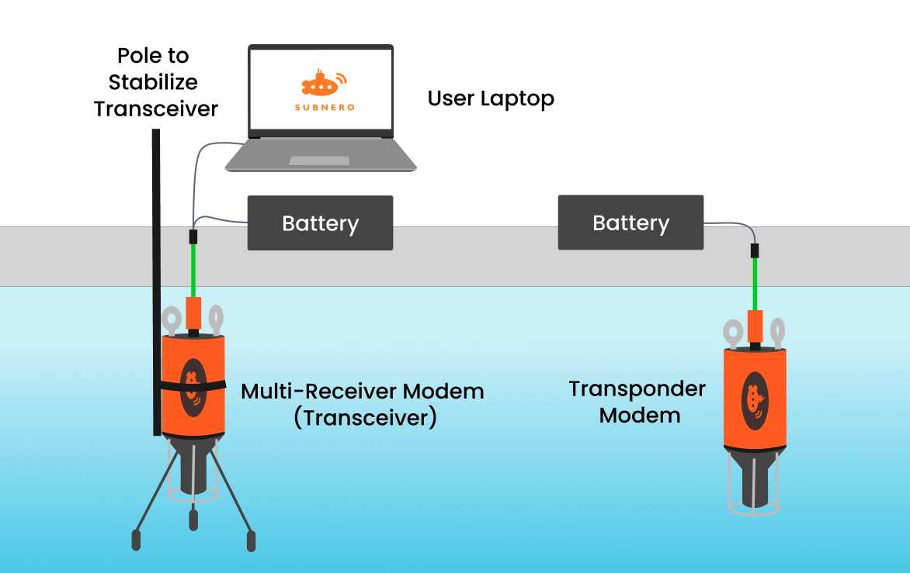
</div>

## Launching the USBL Script

With the hardware now in place, the final step on our journey towards a USBL transceiver is to launch a helper script that does the USBL computation. To this end, please write the receiver geometry into a text file, starting with one line containing the whitespace-separated (x,y,z) coordinates of the transducer followed by three analogous lines for each hydrophone in the order of the labels on their cables.

```julia
# Example geometry file for a tetrahedron with a side length of 15cm
  0.0         0.0     0.0        # Transducer
  0.0866025   0.0    -0.122474   # Hydrophone 1
 -0.0433013   0.075  -0.122474   # Hydrophone 2
 -0.0433013  -0.075  -0.122474   # Hydrophone 3
```

Once the geometry file is ready, we can then launch the USBL script using the following command.

```bash
# Abstract command
./usbl <transceiver IP address> <geometry file>
# Concrete example
./usbl 192.168.42.123 geometry.txt
```

Finally, we can exercise the USBL functionality by running the following commands on the Unet shell.

```groovy
subscribe topic(ranging)
subscribe topic('bearings')
subscribe topic('locations')
range <transponder Unet address>
```

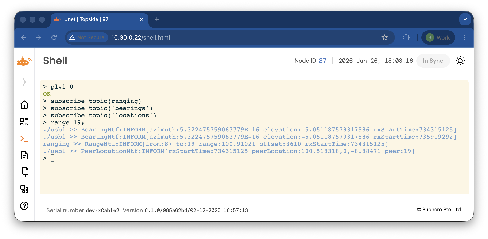

Note that depending on your setup, you may have to increase the power level on both the transceiver and transponder modem for the ranging to be successful; the default power level of -42 is very weak and will not be detectable except at very short ranges. We recommend a power level of -10 as a safe default, and 0 if you need to communicate over long distances. You can change the power level using `plvl <new power level>`, and you can make the new setting persistent across reboots by adding this command to your `startup.groovy` file.

If you have managed to follow along until here, then congratulations: you have just successfully located the transponder modem using nothing but sound! As the above screenshot shows, your modem now reports three pieces of location information.

1. For each incoming signal, it shows a `BearingNtf` reporting in degrees the `azimuth` (horizontal direction, 0° is positive x-axis and 90° is positive y-axis) and `elevation` (vertical direction, 90° is positive z-axis).

  <div style="width: 100%; display: flex; flex-direction: row; justify-content: center; gap: 4rem; flex-wrap: wrap; margin-bottom: 2rem;">
  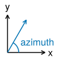
  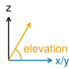
  </div>

2. For each execution of `range`, it shows a `RangeNtf` reporting the `range` in meters to node `to`.
3. Whenever we have both a `Bearing` and `RangeNtf`, the modem also shows a `PeerLocationNtf`.

You can selectively toggle each of these notifications using the corresponding `subscribe` and `unsubscribe` commands. Also, remember that bearing and peer location are reported in the body frame of reference given by the geometry file and that an AHRS sensor may be needed to convert these quantities to world coordinates.

## USBL UI

To make it easier to interpret the USBL output, the `unet-contrib` repo provides a UI extension that visualizes the ranges, bearings and location estimates.

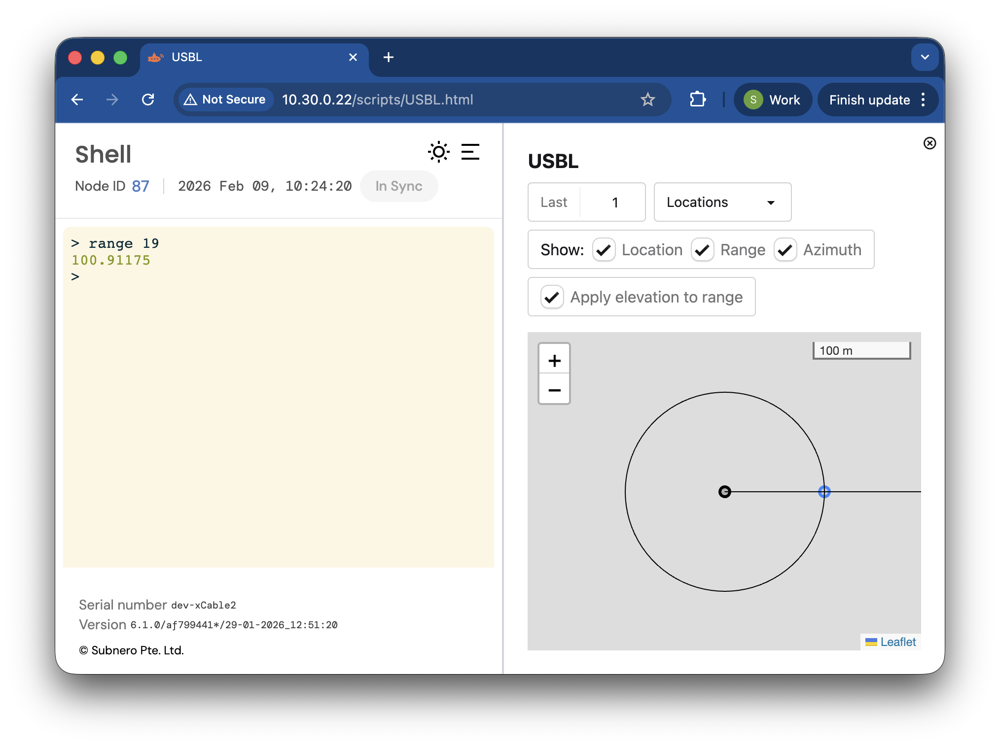

To activate this UI, please proceed as follows.

1. Upload [`ui/dist/USBL.html`](https://github.com/org-arl/unet-contrib/blob/master/contrib/usbl/ui/dist/USBL.html){:target="_blank"} to the `scripts/` folder.
2. Refresh the UI, then go to Dashboards > USBL.html

## How Does This Work?

Now that we have a working USBL transceiver, let us take a closer look at how it actually works. As you may have noticed, there are two topics that require further explanation.

1. How do we trigger the transponder modem to send us a signal, and how do we use this signal to measure the range?
2. How do we estimate the bearing of the incoming signal.

The remainder of this post will answer these two questions.

## Estimating the Range

UnetStack modems constantly monitor the input audio stream for special signals called preambles, and upon detecting a preamble they emit a `DetectionNtf` that lets other software components know about and react to this situation. This setup makes it very easy to measure the distance between two modems.

- On the transponder side, we set up a script to listen for `DetectionNtf` and then reply with a matching response signal after some predefined delay $$\Delta T > 0$$.
- On the transceiver side, we emit an interrogation signal at time $$T_1$$, then wait for a matching `DetectionNtf` and read from it the time of arrival $$T_2$$. The range between the transceiver and transponder is then given by

  $$
    r = \tfrac{c}{2} \, (T_2 - T_1 - \Delta T)
  $$

  where $$c$$ is the speed of sound in water.

This logic is built into UnetStack in the form of the `range()` command. Therefore, no additional code is required to realize the ranging part of our USBL system.

## Estimating the Bearing

Slightly more work is required to get the bearing estimation up and running. At a high level, the algorithm for doing so consists of two steps.

1. Upon receiving a `DetectionNtf`, we determine the precise arrival times $$t_i$$ on each channel $$i \in \{0,1,2,3\}$$.

2. Given these arrival times and the known receiver positions $$x_i \in \mathbb{R}^3$$, we can then compute a corresponding direction of arrival $$u \in \mathbb{R}^3$$.

The second of these steps is quite straightforward. In fact, all it takes to convert arrival times $$t_i$$ into a bearing estimate $$u$$ is to evaluate

$$
u = - \frac{\Delta x^{-T} \Delta t}{\| \Delta x^{-T} \Delta t \|_2}
$$

where

$$
\Delta x
=
\big[\, \Delta x_1 \,\,\, \Delta x_2 \,\,\, \Delta x_3 \, \big]
\qquad\text{with}\qquad
\Delta x_i = x_i - x_0
$$

is a square matrix with the spatial offsets $$\Delta x_i$$ between the hydrophones and the transducer as its columns, and similarly

$$
\Delta t
=
\big[\, \Delta t_1 \,\,\, \Delta t_2 \,\,\, \Delta t_3 \bigr]^T
\qquad\text{with}\qquad
\Delta t_i = t_i - t_0
$$

is a vector consisting of the differences in arrival times $$\Delta t_i$$.

The above formula is derived from the observation that the time it takes for the wavefront to move from a hydrophone to the transducer is given by

<div style="width: 100%; display: flex; justify-content: center; gap: 1rem; align-items: center; flex-wrap: wrap;">

$$
\Delta t_i
=
- \frac{\Delta x_i^T \, u}{c}
.
$$

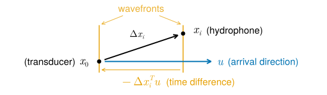

</div>

The suggested formula is then obtained by collecting these individual equations into a combined system, solving for $$u$$ and finally normalising the result to eliminate the dependence on the sound speed $$c$$.

## Estimating the Arrival Times

The last remaining piece in our USBL puzzle is to devise an algorithm for estimating the precise arrival times from the recorded audio signals. Mathematically, this amounts to finding offsets $$o_i$$ such that the signal $$r_i$$ recorded on channel $$i \in \{0,1,2,3\}$$ shifted by the offset $$o_i$$ matches the expected preamble $$p$$, i.e.

$$
r_i[o_i + k] \approx p[k]
\qquad \text{for all} \qquad
k \in \{0, \ldots, N-1\}
,
$$

where $$N$$ denotes the length of the preamble. A standard way to tackle this problem is to determine the offsets $$o_i$$ by maximising the absolute value of the cross-correlation,

$$
o_i = \argmax \, \bigl| c[o] \bigr|
\qquad \text{where} \qquad
c[o]
=
\sum_{k=0}^{N-1} r_i[o + k] \, \overline{p[k]}
.
$$

(We assume here that $$r_i$$ and $$p$$ represent complex-valued baseband samples and hence apply complex conjugation $$x \mapsto \overline{x}$$ to one of the factors when evaluating the cross-correlation.)

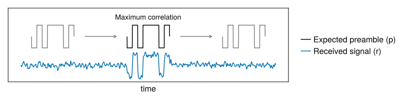

Our USBL code is based on this correlation maximization idea but applies two further refinements.

- Rather than looking for the strongest arrival, our algorithm looks for the earliest arrival by locating the earliest peak that reaches at least half of the maximum correlation. This modification makes the algorithm more robust against echoes from nearby reflectors.

  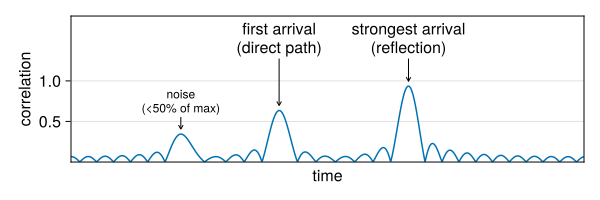

- We subsample the correlation signal by a factor eight to increase the precision of the estimated arrival times.

  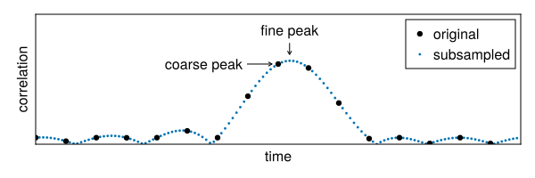

That's it! With these modifications, we now have a complete set of algorithms for tracking a target underwater. If you'd like to know more about how to implement these algorithms, then we encourage you to take a look at the [`usbl-julia` folder](https://github.com/org-arl/unet-contrib/tree/master/contrib/usbl/usbl-julia){:target="_blank"} in `unet-contrib`. As you will see, UnetStack's open architecture makes it very easy to extend a modem's functionality using just a few lines of code!

## Appendix: Setting Up a VirtualAcousticOcean Test Environment

Setting up a USBL mount and deploying it in a body of water large enough to support USBL testing can be logistically challenging. To facilitate testing in a lab, the `unet-contrib` repository contains a script that allows you to deploy your modems in a [VirtualAcousticOcean](https://github.com/org-arl/VirtualAcousticOcean.jl){:target="_blank"} simulation environment. This script reconfigures the very lowest layers of the modems' networking stacks such that rather than transmitting and receiving signals via the attached physical hardware, they instead communicate via a simulator that imitates the distortions that would have been observed if the modems had been deployed in a real ocean. All that is needed to activate this environment is to run the following command.

```bash
# Abstract command
./vao <transceiver IP address> <transponder IP address>
# Concrete example
./vao 192.168.42.123 192.168.42.45
```

Among other things, this command will reboot your modems. Once they are back online, you can test that everything is set up correctly by running the following commands on the Unet shell of one modem and verifying that the other modem receives the message.

```groovy
plvl 0
tell <peer Unet address>, 'hello world'
```

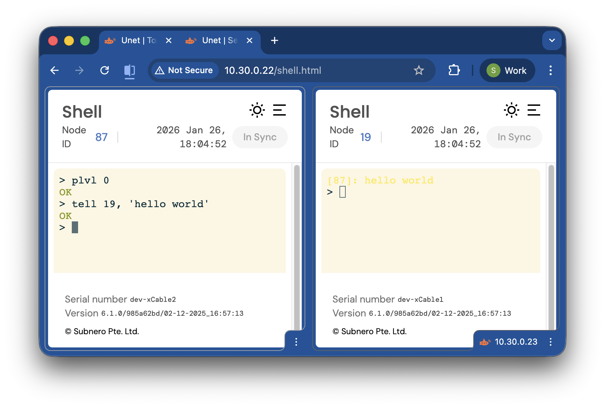

Please note that after activating a VirtualAcousticOcean configuration, the modems will remain in this configuration until it is actively removed. You can return the modems to transmitting and receiving via their onboard hardware by deleting the `modem.toml` files in their respective `scripts/` folders.

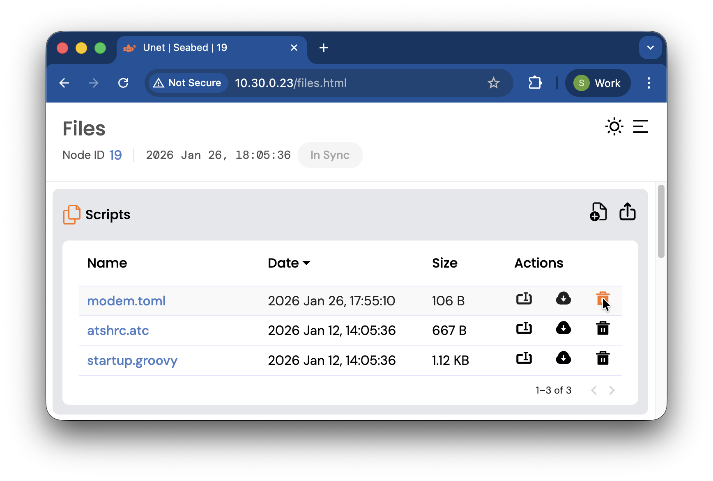

Please also see our [earlier blog post](https://blog.unetstack.net/running-hardware-in-the-loop-simulations-using-unetstack-modems) for more information on using UnetStack modems with VirtualAcousticOcean.
